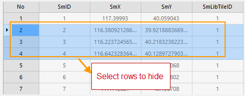
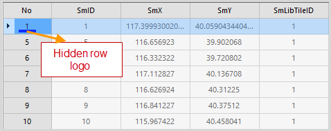

### Introduction

It is used to hide the selected rows.

### Basic Steps

  1. Open attributes table: right click a vector dataset, choose Browse Attributes, or double click a tabular dataset.
  2. Select one or more rows, with using Shift or Ctrl key.
  3. Click Attribute Table>Browse, click Hide Row, or right click to select Hide Row.
  4. That selected row will not be displayed in the attributes table, the previous row will be selected, and a "Hide Row" mark will be displayed after the row.
|   

###  Note

  1. Only after selecting a row, the Hide Row function is valid.
  2. The Hide Row function will not delete the row, but make it invisible, users can use Show Hidden Rows to display it.
  3. If uses close the attributes table then open it again, it will show all rows and columns.

 [Sort Ascending](SortOrderAscendingButton.htm)

 [Sort Descending](SortOrderDescendingButton.htm)

 [Hide Column](HideButton.htm)

 [Show Hidden Columns](CancelHideButton.htm)

 [Show Hidden Rows](CancelHideRows.htm)

 [Filter](FilterButton.htm)

 [Go To](GoToButton.htm)

 [Show Hexadecimal](DisplayHexadecimal.htm)

