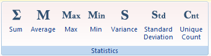

The **Statistics** group on the Attributes tab provides 7 statistic functions for attribute information of vector datasets.

  
 
Figure: The Statistics group  
  
[Sum](SumButton.htm)

[Average](AverageButton.htm)

[Max](MaxButton.htm)

[Min](MinButton.htm)

[Variance](VarianceButton.htm)

[Standard Deviation](StdDeviationButton.htm)

[Unique Count](CountOfValueButton.htm)

