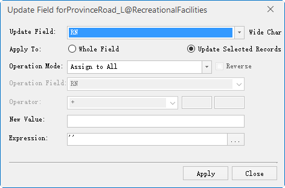

### Description

Update a whole field or the selected cells in a field by constructing the criteria.

### Basic Steps

  1. Open a tabular dataset or the attribute table of a vector dataset.
  2. To update the contents of the selected cell, you need to first select the cells to be updated in the attribute table. Click Update Field in the Attributes tab, or click the right mouse button and select Update Column. The Update Field dialog box is displayed. As shown below: 
  
Figure: Update Column Dialog Box  
  3. Click the drop-down button to the right of the Update Field button and select the fields to be updated.
  4. Apply To: Update whole field and update selected Records. 
    * Whole Field: Update all field values in the specified field to be updated.
    * Update Selected Records: Updates the selected records in the specified field to be updated.
  5. Operation Mode: To specify the value of the source used to update the attribute table field values, specific instructions, see [ value source ](ValueFrom.htm) page. 

Operation Mode

Operation Mode | Description  
---|---  
Assign to All | By specifying a value, the value of the cell within the specified update range is updated to this value.   
Single-field  | Constructs a simple mathematical expression for a specified field with a specified value. In the specified update range, for a record to be updated cells, get the specified field attribute value and the user-specified value, operation, construction calculation equation operation, the return value is the cell value after the update.  
Double-field  |Constructs a simple mathematical expression based on the specified two fields and the specified operation. In the specified update range, for a record to be updated cells, get the specified two fields of the attribute value and user-specified operation, the construction of computing equations to operate, the return value is the cell value after the update. 
Function  | Constructs a function expression for a field based on a specified field, according to a user-specified function rule. In the specified update range, for a record to be updated cells, get the specified field attribute values and user-specified operation function, build a function expression to operate, the return value is the cell value after the update.  
  
  6. Reverse: When the Operation Mode is Single-field or Double-field, check this box to exchange the position of the parameter on both sides of the expression, and then perform the operation of the expression.
  7. Operation Field: When the Operation Mode is Single-field or Function, Operation Field is used to specify a field used to construct a mathematical expression or function expression.

  8. Operation Field 2: When the Operation Mode is Double-field, Operation Field 2 is used to specify the two fields involved in constructing an operation expression.
  9. Operator: When the Operation Mode is Single-field or Double-field, the Operator is used to specify the algorithm between Single-field and Double-field. 

Function

Function  | Description  
---|---  
+ |  On the numeric parameters, the value is added to the two, return a value; character parameters, is to connect two characters, in front of the new parameters in front of the characters, only "+" operation between character parameters.  
- | Only numerical parameters have this operation, the operator in front of the value minus the operator behind the value.  
* | Only numerical parameters have this operation, the operator in front of the value multiplied by the value of the operator.  
/ |Only numerical parameters have this operation, the value preceding the operator is divided by the number following the operator, when the divisor is zero, the operation can not be performed and the value of the dividend is returned.  
% | Only numerical parameters have this operation, the value preceding the operator is divided by the number following the operator, and the remainder is returned. When the divisor is zero, the operation can not be performed and the value of the dividend is returned.  
  
  10. Function: When the Operation Mode is Function, it is used to specify the operation fuction. 
    * The two text boxes at the right of the "Function" can be used to specify other parameter information for the function. See [ Math Functions ](Functions.htm) page for instructions.
    * Also you can click "More" in the drop-down list of Function, and customize expressions in the pop-up SOL Expression dialog box. 
  11. Expression: Used to display and edit the expression to be constructed. Click the button on the right side of the combo box to bring up the SQL Expression dialog box. You can either construct a field expression in the dialog box that pops up or enter a field expression directly in the Expression text box. About SQL expression, please see [ SQL Expression Dialog ](../../Query/SQLDia.htm).

  12. Click Apply to update the property sheet.
  13. Click the Close button to exit the current Update Field dialog box.

### Note

  * When the attribute table is in the filter state, the update column operation, only the filter out of the record field value to update.

### Related Topics

 [Copy and Paste](CopyAndPaste.htm)

 [Drag and Drop](DragTabular.htm)

 [Update](UpdateTabular.htm)

 [Delete Records](DeleteRecordsButton.htm)

 [Add Records](AddRecordsButton.htm)

 [Undo/Redo](UndoButton.htm)

 [Binary Edit](BinaryEdit.htm)

  

