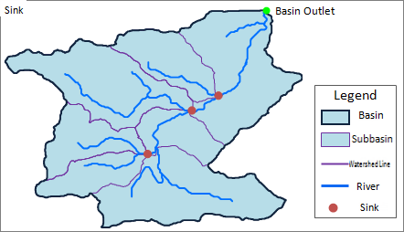

### Hydrology Analyst

Hydrological analysis is based on a digital elevation model (DEM) raster data
to establish a water system model, which is used to study the hydrological
characteristics and simulation of surface hydrological process, and make a
forecast for the surface hydrological situation in the future. The
hydrological analysis model can help us to analyze the scope of the flood,
position the runoff pollution sources, and predict geomorphological change on runoff. It is widely used in regional planning, agriculture, forestry,
disaster prediction, road design, and many other industries and fields.

### Basic Concepts

Hydrology analysis is based on DEM. The following concepts are important.

  
**Water System**: A water network system in the same basin. Water system includes rivers, lakes, swamps, reservoirs, etc.

**Basin**: An area that receives water from lands, and this area of water system is called basin or catchment.

**Subbasin**: An entire basin is composed of several subbasins.

**Watershed**: Watershed is usually determined by mountains or highlands.

**Catchment Point**: The end of a river that pours water to a larger area.

