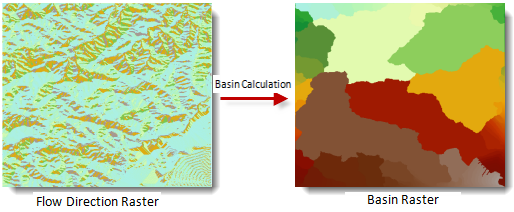

The drainage basin refers to the catchment. The basin calculation is to create a raster dataset for basin.

### Introduction

The calculation of the drainage basin is based on flow data. Each cell is assigned a unique basin. As shown below, a drainage basin shows that all the interconnected grids in the same drainage basin.

  
---  
  
In general, all the pour points are located in the boundary. So, firstly, you have to determine the pour points, and then identify the watershed, and finally determine the basins.

If you check Force boundary cells pour outside, the result will be better. For more information, see [Calculate Flow Direction](CalFlowDirection).

### Functional Entrances

  * Click **Spatial Analysis** > **Raster Analysis** > **Hydrology Analysis**. In the **Workflow Manager** window select **Drainage Basin**. (SuperMap iDesktop)
  * Click **Spatial Analysis** > **Raster Analysis** > **Hydrology Analysis** drop-down button and select **Calculate Drainage Basin**. (SuperMap iDesktopX)
  * **Toolbox** > **Raster Analysis** > **Hydrology Analysis** > **Calculate Drainage Basin**. (SuperMap iDesktopX)

### Parameter Description

  * **Flow Direction Data** : Select the flow direction datasource and dataset.
  * **Result Data** : The result names of datasource and dataset.
  * Click **Ready** to finalize the preparation of parameters. And so, you can execute the operation anytime. If you click Cancel Ready, you can continue setting parameters. Note: Click the **Ready** dropdown button, the Cancel All button appears, it is used to cancel all ready status of all the steps.
  * Click **Execute**. The output window will tell you if it is successful or not.
