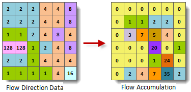

The flow accumulation is based on the flow direction. You can use weight data to calculate the weight flow accumulation.

The idea of calculating flow accumulation:

Suppose that every cell has "1" accumulation. Based on flow direction, the flow accumulation for every cell can be calculated, which is shown as follows:

    
  
### Introduction

  * The result shows the total accumulation for every cell. Each value is determined by all upstream cells except current cell itself.
  * In practical applications, the amount of water for each cell is not necessarily the same. It needs to specify the weight to obtain cumulative sinks. After the use of the weight, each cell of the water is no longer a unit, but multiplied by the weight. 
  * The result helps us identify the valley and the watershed. If the value of the accumulation is high, this place is valley; if the value is 0, this place is watershed. So, flow accumulation offers references for calculating area, perimeter, drainage density, etc.).

### Functional Entrances

  * Click **Spatial Analysis** > **Raster Analysis** > **Hydrology Analysis**. In the **Workflow Manager** window select **Flow Accumulation**. (SuperMap iDesktop)
  * Click **Spatial Analysis** > **Raster Analysis** > **Hydrology Analysis** drop-down button and select **Calculate Flow Accumulation**. (SuperMap iDesktopX)
  * **Toolbox** > **Raster Analysis** > **Hydrology Analysis** > **Calculate Flow Accumulation**. (SuperMap iDesktopX)

### Parameter Description

  * **Flow Direction Data** : Select the flow direction datasource and dataset.
  * **Weight Data** : If you check it, the flow accumulation data is weighted.
  * **Result Data** : The result names of datasource and dataset.
  * Click **Ready** to finalize the preparation of parameters. And so, you can execute the operation anytime. If you click Cancel Ready, you can continue setting parameters. 

**Note** : Click the **Ready** dropdown button, the Cancel All button appears, it is used to cancel the ready status of all the steps.

  * Click **Execute**. The output window will tell you if it is successful or not.
