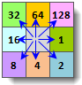
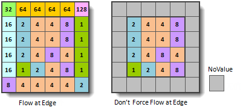
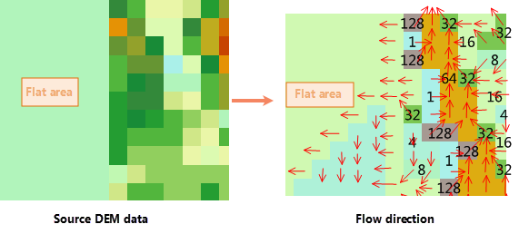

The flow direction, i.e. the hydrological direction of the flow. The
calculating flow is one of the key steps in the hydrological analysis.
Hydrological analysis functions based on the flow grid, such as the cumulative
water, the flow length and watershed.

In SuperMap, a center grid has 8 neighboring grids with values 1,2, 4, 8, 16,
32, 64, 128, which indicates 8 directions, that is, east, southeast, south,
southwest, west, northwest, north, and northeast. The flow direction for a
center grid is determined by its value. For example, the value of flow
direction is 16, it means that the water runs to west.

  

  
### Introduction

**How to process water in boundaries**

As the grid cells in boundaries have less than eight neighboring grid cells. So, the flow directions of those grid cells can be treated as flowing outside, or can be treated as no value.

  
  
**Gradient Grid for Elevation Changes**

The flow direction is determined by the maximum gradient. Elevation Gradient = (Center Elevation - Neighboring Elevation) / Distance

**The flow direction of flat areas**

Flat areas are the areas that the elevation gradient is 0. The application will raise the flat area to make each point have the flow direction. The application performs the raising operation according to the elevation around the flat area, calculates the most steep slope, and take the slope direction as the flow direction.

  
  
### Functional Entrances

  * Click **Spatial Analysis** > **Raster Analysis** > **Hydrology Analysis**. In the **Workflow Manager** window select **Flow Direction**. (SuperMap iDesktop)
  * Click **Spatial Analysis** > **Raster Analysis** > **Hydrology Analysis** drop-down button and select **Calculate Flow Direction**. (SuperMap iDesktopX)
  * **Toolbox** > **Raster Analysis** > **Hydrology Analysis** > **Calculate Flow Direction**. (SuperMap iDesktopX)

### Parameter Description

  * **Source Data** : Set the datasource and the dataset of DEM for flow direction.
  * **Force the flow direction outwards if it is at edge** : If you check it, water in boundary cells flows outwards.
  * **Create the changing elevation gradient** : Calculates the gradient change for each cell. By default, it is unchecked.
  * Result Data: Set the result datasource, flow direction dataset and gradient dataset. Note that the gradient dataset can be input only when "Create elevation gradient" is checked.
  * Click **Ready** to finalize the preparation of parameters. And so, you can execute the operation anytime. If you click Cancel Ready, you can continue setting parameters. 

Note: Click the **Ready** dropdown button, the Cancel All button appears, it is used to cancel the ready status of all the steps.

  * Click **Run**. The output window will tell you if it is successful or not.
