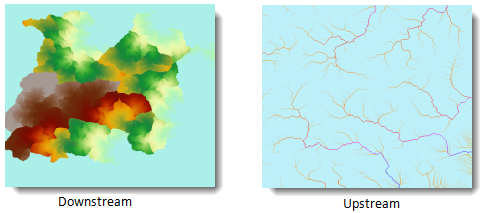

Flow Length is used to calculate the length between each cell and the outlet
(or source) along the flow path. The result is a Grid dataset. Flow Length is
commonly used for flood calculation. Water flows can be affected by factors
such as slope, soil moisture and vegetation cover, weight dataset is needed to
model these factors.

### Introduction

  * The flow length must be based on flow direction. See [Flow Direction](CalFlowDirection).
  * Before calculating the flow length, you need to set directions. 
    * Downstream: Calculate the length of the flow path between each cell and its corresponding outlet on the edge of the raster.
    * Upstream: Calculate the length of the longest flow path between each cell and its source cell on the watershed boundary.

The images below shows the upstream and downstream flow length.

  
  
  * For weight distance, a weight dataset should be specified for calculating the flow length. 

In Flow Length Analysis, Flow Direction Data provides the flow direction of streams, this dataset can be created through Flow Direction Analysis. Weight dataset defines the impedance of each cell in the raster.

### Functional Entrances

  * Click **Spatial Analysis** > **Raster Analysis** > **Hydrology Analysis**. In the **Workflow Manager** window select **Flow Length**. (SuperMap iDesktop)
  * Click **Spatial Analysis** > **Raster Analysis** > **Hydrology Analysis** drop-down button and select **Calculate Flow Length**. (SuperMap iDesktopX)
  * **Toolbox** > **Raster Analysis** > **Hydrology Analysis** > **Calculate Flow Length**. (SuperMap iDesktopX)

### Parameter Description

  * **Flow Direction Data** : Select the flow direction datasource and dataset.
  * **Weight Data** : If you check it, the flow direction data is weighted.
  * **Measure Type** : Downstream or upstream.
  * **Result Data** : The result names of datasource and dataset.
  * Click **Ready** to finalize the preparation of parameters. And so, you can execute the operation anytime. If you click Cancel Ready, you can continue setting parameters. Note: Click the **Ready** dropdown button, the Cancel All button appears, it is used to cancel the ready status of all the steps.
  * Click **Execute**. The output window will tell you if it is successful or not.
