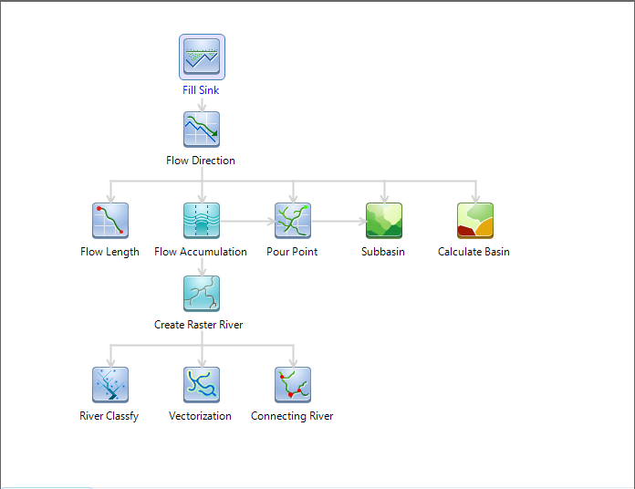

### Hydrology Analyst

Hydrological analysis is based on a digital elevation model (DEM) raster data
to establish a water system model, which is used to study the hydrological
characteristics and simulation of surface hydrological process, and make a
forecast for the surface hydrological situation in the future. The
hydrological analysis model can help us to analyze the scope of the flood,
position the runoff pollution sources, and predict geomorphological change on
runoff. It is widely used in regional planning, agriculture, forestry,
disaster prediction, road design, and many other industries and fields.

The confluence of the surface water is largely determined by the surface
shape. DEM data is able to express the spatial distribution of the regional
topography. It has outstanding advantages in the description of watershed
topography, such as watershed boundaries, slope, and aspect, extracting
drainage, thus very suitable for hydrological analysis.

SuperMap hydrological analysis contains filling sinks, calculating flow
direction, calculating length, calculating cumulative water, watershed
divided, river grading, connecting water system and vectorization.

  
---  
Figure: Workflow of Hydrology Analysis  
  
### Main Contents:

[Overview of Hydrology Analysis](AboutHydrologyAnalyst)

[Introduction to Workflow Manager of Hydrology Analysis](Introduction)

[Fill Sink](FillSink)

[Calculate Flow Direction](CalFlowDirection)

[Calculate Flow Accumulation](CalFlowAcc)

[Calculate Flow Length](CalFlowLength)

[Calculate Basin](CalBasin)

[Basin Division](Watershed)

[Extract Grid Water System](RasterStream)

[River Classification](StreamOrder)

[Connect Water System](StreamLink)

[Water System Vectorization](StreamToLine)

### Related Topics

The workflow management helps you manage and customize all modules automatically. The hydrology analysis module uses this management.

[Introduction for Process Management Window](../UIIntroduct/proceduremanage)
