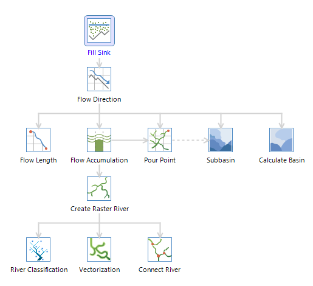
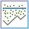
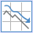
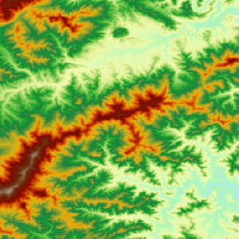

### Introduction

Hydrological analysis is based on a digital elevation model (DEM) raster data
to establish a water system model, which is used to study the hydrological
characteristics and simulation of surface hydrological process, and make a
forecast for the surface hydrological situation in the future. The
hydrological analysis model can help us to analyze the scope of the flood,
position the runoff pollution sources, and predict geomorphological change on
runoff. It is widely used in regional planning, agriculture, forestry,
disaster prediction, road design, and many other industries and fields.

SuperMap hydrological analysis contains [filling sinks](FillSink),
[calculating flow direction](CalFlowDirection), [calculating
length](CalFlowLength), [calculating cumulative water](CalFlowAcc),
[watershed divided](StreamOrder), [river grading](StreamLink),
[connecting water system and vectorization](StreamToLine).

### Basic Steps

  1. Open the **BeijingTerrain** in the ExerciseData/RasterAnalysis group and use the terrain data in the datasource for this example.
  2. In the Raster Analysis group of the Analysis tab, Click Hydrology Analysis.   
  3. In this example, you will see how to extract water system.
  4. Click the Fill Sinks icon  to display the Fill Sinks dialog box. If there are real sinks, check Sink Data to be Excluded, select the sink dataset, then the sinks specified will not be filled. Click Ready.  
  5. Click the Flow Direction icon  to display the Flow Direction dialog box. Decide whether to check Force Flow at Edge and Create Elevation Change Gradient. For details, please refer to Calculating Flow Direction in  Help. When finished, click Ready. 
  6. Click the Flow Accumulation icon  to display the Flow Accumulation dialog box. If you already have the weight data, check Weight Data and weight raster will be considered during the calculation. When finished, click Ready.
  7. Click the Extract Raster River icon to display the Extract Raster River dialog box. Set a proper threshold, then cells with accumulation greater than the specified value will be extracted as river. Whether the threshold is reasonably set decides whether the water system can be correctly extracted. Select the pixel format of the result dataset, and decide whether to check Compact Dataset or Ignore NoValue Cell. When finished, click Ready. 
  8. Click the Vectorization icon  to display the Vectorization dialog box. Select a river classification method. You can either choose Shreve or Strahler. When finished, click Ready.
  9. When everything is ready, click Execute in the Vectorization dialog box to execute the vectorization of the water system.  
 

### Note

Results of the previous step will be used as source of the next step. You do not need to configure manually during the calculation.
