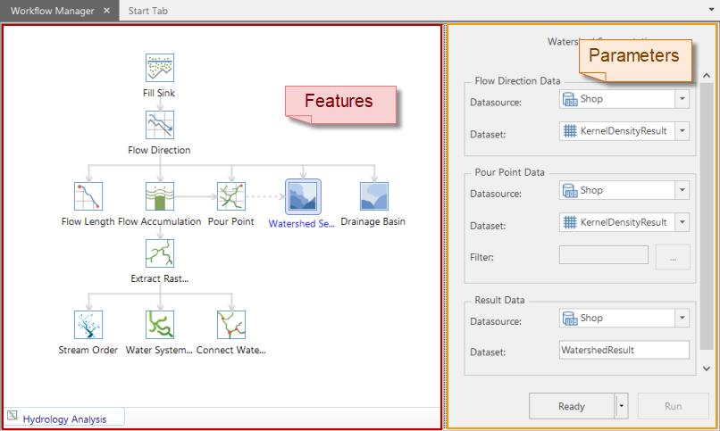
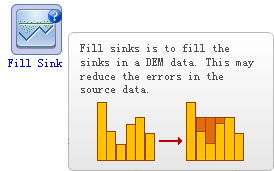

SuperMap iDesktop provides you a workflow manager to manage hydrology analysis.

Click Spatial Analysis > Raster Analysis > Hydrology Analysis.

### Workflow Manager of Hydrology Analysis

  
  
The workflow manager has two parts. The left part shows all steps of hydrology analysis and their relations. The right part offers parameters related to the left steps.

**Function Section**

The function section contains all steps of hydrology analysis, that is, Fill Sink, Flow Direction, Flow Length, Flow Accumulation, Pour Point, Drainage Basin, and so on. From the structure of the steps, we can clearly understand the relationships among them.

If you press your mouse wheel on the function section (the mouse icon is changed to ), you can move the structure.

Click a step you are interested in, and then see its related parameters on the right part.

  

**Parameter Settings**

You set source data, result data and other parameters on the right part. After you have set all parameters, you click Ready, and then click Execute.

Ready and Execute:
  1. Ready is to make the whole workflow ready.
  2. Execute is available only when it is Ready.
  3. If there is only one function is Ready, you click Execute to run this function. If several functions are Ready, you click Execute to run the functions that are ready.
  4. If you execute several functions, the result of the previous step is treated as the input data. If users want to use the data in other datasource, they can reset it.
