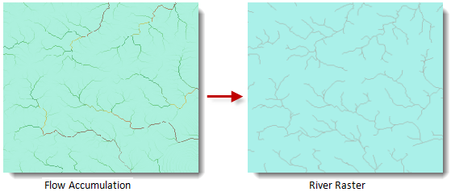

### Introduction

The grid water system extraction is the first step for the following water system extraction.

As we know, if a cell has high accumulative water, this cell can be treated as the valley. So, you can set a value, cells whose water accumulation is greater than this value will be extracted. In this case, the grid water system is calculated. In practice, the values differ based on different valley. So, you should practise more to determine this value.

For example, if the water accumulation is greater than 2000, the cell is treated as the catchment. In this case, the express for grid water system extraction is:

     [Datasource.WaterAccumulationGrid] > 2000

After calculating, if the water accumulation of the cells is greater than 2000, the cell is assigned to 1; otherwise, assigned to 0.

The following picture shows the grid water system extraction:

  
  
### Functional Entrances

  * Click **Spatial Analysis** > **Raster Analysis** > **Hydrology Analysis**. In the **Workflow Manager** window select **Extract Raster Water System**. (SuperMap iDesktop)
  * Click **Spatial Analysis** > **Raster Analysis** > **Hydrology Analysis** drop-down button and select **Extract Raster Water System**. (SuperMap iDesktopX)
  * **Toolbox** > **Raster Analysis** > **Hydrology Analysis** > **Extract Raster Water System**. (SuperMap iDesktopX)

### Parameter Description

  * **Flow Accumulation Data** : Select the flow accumulation datasource and dataset.
  * **Accumulation** : The water accumulation you want to extract.
  * **Result Data** : Set the result datasource, dataset and the pixel format. There are 8 formats: 1-bit, 4-bit, single byte, double byte, int, long int, float, and double. For more information, see [Pixel Format for Raster Dataset](../Analyst/VectorRasterConvert/PixelFormat).
  * **Compact Dataset** : If it is checked, the result dataset is compacted. By default, it is not compact.
  * **Ignore NoValue Cell** : If this box is checked, the pixel value in the result dataset is null (-9999 in general); if it is unchecked, the min or max value of the result dataset may be changed. 
  * Click **Ready** to finalize the preparation of parameters. And so, you can execute the operation anytime. If you click Cancel Ready, you can continue setting parameters. Note: Click the **Ready** dropdown button, the Cancel All button appears, it is used to cancel the ready status of all the steps.
  * Click **Execute**. The output window will tell you if it is successful or not.
