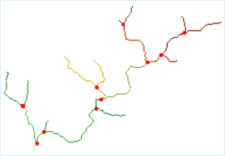
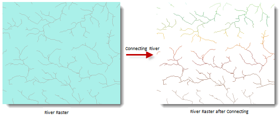

### Introduction

To connect water system is based on the grid water system and flow direction. It assigns each river in the water system a unique value.

The water system connection records the node connection information. The red point below is the intersection point between two river segments. A river segment connects two intersection points, or an intersection point and a pour point, or an intersection point and a watershed.

  
  
In the result of water system, the river segments should be greater than or equal to 1.

   
  
### Functional Entrances

  * Click **Spatial Analysis** > **Raster Analysis** > **Hydrology Analysis**. In the **Workflow Manager** window select **Connect Water System**. (SuperMap iDesktop)
  * Click **Spatial Analysis** > **Raster Analysis** > **Hydrology Analysis** drop-down button and select **Connect Water System**. (SuperMap iDesktopX)
  * **Toolbox** > **Raster Analysis** > **Hydrology Analysis** > **Connect Water System**. (SuperMap iDesktopX)

### Parameter Description

  * **Water System Data** : Select the datasource and dataset of the grid water system.
  * **Flow Direction Data** : Select the datasource and dataset of the flow direction. See [Calculate Flow Direction](CalFlowDirection).
  * **Result Data** : The result names of datasource and dataset.
  * Click **Ready** to finalize the preparation of parameters. And so, you can execute the operation anytime. If you click Cancel Ready, you can continue setting parameters. **Note** : Click the Ready dropdown button, the Cancel All button appears, it is used to cancel the ready status of all the steps.
  * Click **Execute**. The output window will tell you if it is successful or not.
