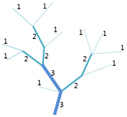
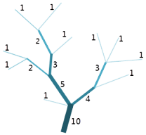

Based on grid water system, rivers are numbered. No larger value the number is, the higher level the river is. SuperMap provides two method: Strahler and Shreve.

### **Strahler River Classification**

Strahler: the river source is the first level; if the river formed by two same level, then level of the river plus one; if the river formed by two different levels, then the level of this river equals to the original river with higher level.

Strahler doesn't consider all connections of the water system. Only the highest level remains.

  
  
### **Shreve River Classification**

Shreve: the river source is the first level; if the river formed by two rivers, then the level of the river is the sum of the two. As shown below:

Shreve considers all the connected rivers in the water system. The level of the connected rivers represents the number of rivers in upstream.

  
