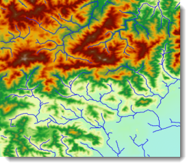

### Introduction

Water System Vectorization is to convert the grid water system to the vector water system, and store the river level to the attribute table. The following picture is DEM and the vector water system.

  
  
By this method, the result retains the information of the river level and flow direction.

  * Vector river extraction calculates each river level and automatically adds a file named "StreamOrder" attribute field to store the value of the resulting dataset. For the classification methods, see [River Classification Method](StreamOrderType).
  * The flow of information is stored in the result dataset called "Direction" field, expressed as 0 or 1. 0 indicates the direction of the flow of the line object geometry, 1 represents the line object geometry in the opposite direction. The "Direction" field value is 0.

### Functional Entrances

  * Click **Spatial Analysis** > **Raster Analysis** > **Hydrology Analysis**. In the **Workflow Manager** window select **Water System Vectorization**. (SuperMap iDesktop)
  * Click **Spatial Analysis** > **Raster Analysis** > **Hydrology Analysis** drop-down button and select **Water System Vectorization**. (SuperMap iDesktopX)
  * **Toolbox** > **Raster Analysis** > **Hydrology Analysis** > **Water System Vectorization**. (SuperMap iDesktopX)

### Parameter Description

  * **Water System Data** : Select the datasource and dataset of the grid water system.
  * **Stream Order** : Select a river classification method. For more information, see [River Classfication Method](StreamOrderType).
  * **Flow Direction Data** : Select the datasource and dataset of the flow direction. See [Calculate Flow Direction](CalFlowDirection).
  * **Result Data** : The result names of datasource and dataset.
  * Click **Ready** to finalize the preparation of parameters. And so, you can execute the operation anytime. If you click Cancel Ready, you can continue setting parameters. **Note** : Click the **Ready** dropdown button, the Cancel All button appears, it is used to cancel the ready status of all the steps.
  * Click **Execute**. The output window will tell you if it is successful or not.
