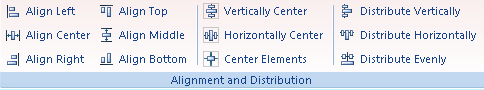

The **Align** group on the **Object Operations** tab provides commands for aligning and distributing elements in the layout window.

  
Figure: The Align and Distribute group  
  
Commands organized in the Align and Distribute group include:

[Align Left](NudgeLeftbutton.htm)

[Align Right](NudgeRightbutton.htm)

[Align Top](NudgeUpbutton.htm)

[Align Bottom](NudgeDownbutton.htm)

[Align Center](FitWidthtoMarginsbutton.htm)

[Align Middle](FitHeighttoMarginsbutton.htm)

[Vertically Center](VerticalCenterbutton.htm)

[Horizontally Center](HorizontalCenterbutton.htm)

[Center Elements](AlignCenterbutton.htm)

[Distribute Vertically](DistributedVerticallybutton.htm)

[Distribute Horizontally](DistributedHorizontallybutton.htm)

[Distribute Evenly](AlignSameDistancebutton.htm)