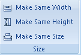

The Size group provides commands for making the selected elements the same width, height or size. While multiple text objects are selected at the same time, the following 3 functions will not be invalid.

  
Figure: The Size group  
  
Commands organized in the Size group include:

[Make Same Width](MakeSameWidthbutton.htm)

[Make Same Height](MakeSameHeightbutton.htm)

[Make Same Size](MakeSameSizebutton.htm)