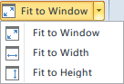

On the **Layout** tab, the Fit to Window button in the Browse group is used to adjust the display effect of layout page in the window. Click the drop down button. You can set the layout Fit to Window, Fit to Width and Fit to Height.

  
Figure: Fit to Window button and the drop-down menu  
  
### Fit to Window

Fit to Window.

  * To make the current window display a full page, we choose **Layout** and then click **Fit to Window** in **Browse** group, in which the layout is zoomed in or out to fit the window to display a complete and maximized layout in the current window. 
  * Also, you can press F6 to fit the layout to the window.

### Fit to Width

Fit to Width is to make the layout width keep pace with window width, and display the current layout.

  * Click **Fit to Width** to make the width of layout same as layout window, that is, according to the window size, current layout adjusts the scale to display a complete and maximum width. 

### Fit to Height

Fit to Height is to make the layout Height keep pace with window Height, and display the current layout.

  * Click **Fit to Height** to make the height of layout same as layout window, that is, according to the window size, current layout adjusts the scale to display a complete and maximum height. 