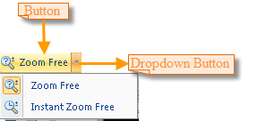

### Zoom In

The Zoom In button allows you to zoom in the layout by clicking a point or dragging a box.

On the **Layout** tab, in the **Browse** group, click the **Zoom In** button to change the mouse pointer to .

  * Zoom in by clicking a point: Click in the layout window to zoom in the layout by 2 times.
  * Zoom in by dragging a box: Hold down the left mouse button and drag along the diagonal to draw a temporary box, and then release the left mouse button to zoom in the layout. The layout will be zoomed in from the center of the temporary by either the width, or height ratio of the layout window and the box. The smaller ratio will be chosen as the zoom in factor.

Except for clicking the Zoom In button, you can also press the Z key on the keyboard to switch to the zoom in mode.

### Zoom Out

The Zoom out button allows you to zoom out the layout by clicking a point or dragging a box.

On the **Layout** tab, in the **Browse** group, click the **Zoom Out** button to change the mouse pointer to .

  * Zoom in by clicking a point: Click in the layout window to zoom in the layout by 2 times.
  * Zoom out by dragging a box: Hold down the left mouse button and drag along the diagonal to draw a temporary box, and then release the left mouse button to zoom out the layout. The layout will be zoomed out from the center of the temporary box by either the width, or height ratio of the layout window and the box. The smaller ratio will be chosen as the zoom out factor.

Except for clicking the Zoom In button, you can also press the Z key on the keyboard to switch to the zoom in mode.

### Zoom Free

The Zoom Free command allows you to freely zoom in or out the Layout. The Zoom Free drop-down button appears in two parts: the image part and the text part with a drop-down arrow. You can click the image to directly implement the corresponding action, or the text to select a specific command from list.

  
Figure: The Zoom Free drop-down button
  
### Zoom Free

Click the text part of the Zoom Free drop-down button to display the drop-down list, then click Zoom Free. The mouse pointer turns to  in the layout window.

  * Hold down the left mouse button and drag to zoom in or out the layout, then release the left mouse button and the map will be refreshed.
  * White areas may exist during the zoom free operation because the layout is not instantly refreshed. For each zoom free operation, the layout is refreshed after you release the left mouse button.
  * To instantly refresh the layout during the zoom free operation, please use the Instant Zoom Free command.

### Instant Zoom Free

Click the text part of the Zoom Free drop-down button to display the drop-down list, then click Instant Zoom Free. The mouse pointer turns to  in the layout window.

  * Hold down the left mouse button and drag to zoom in or out the layout, and then release the left mouse button. The layout is fluently displayed because it is instantly refreshed during the instant zoom free operation.