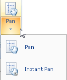

The Pan buttonDropDown allows you to pan across the layout by dragging. The Pan buttonDropDown appears in two parts: the image part and the text part with a drop-down arrow. You can click the image to directly implement the corresponding action, or the text to select a specific command from list.

  
Figure: The Pan buttonDropdown  
  
### Pan

Click the text part of the Pan buttonDropDown to display the drop-down list, then click Pan. The mouse pointer turns to  in the layout window.

  * Hold down the left mouse button and drag to move the layout with the mouse pointer. When you release the left mouse button, the layout will be refreshed.
  * White areas may exist during the zoom free operation because the layout is not instantly refreshed. For each pan operation, the layout is refreshed after you release the left mouse button.
  * To instantly refresh the layout during the pan operations, please use the Instant Pan command.

Except for clicking the Pan button, you can also press the A key on the keyboard to switch to the pan mode.

### Instant Pan

Click the text part of the Pan buttonDropDown to display the drop-down list, then click Instant Pan. The mouse pointer turns to  in the layout window.

  * Hold down the left mouse button and drag to move the layout with the mouse pointer. The layout will be instantly refreshed when you are panning the layout.