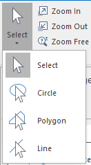

Select map elements, geometric or text objects. The Select drop-down button appears in two parts: the image part and the text part with a drop-down arrow. You can click the image to directly implement the corresponding action, or the text to select a specific command from list.

  
Figure: The Select drop-down button  
  
You can select geometric objects, such as points, lines, regions, etc., text objects and map elements, such as maps, scale bars, north arrows, etc. You can select by:

### Clicking a point or dragging a box

Click the image part of the **Select** drop-down button to display the drop-down list. Click on **Select**.

The mouse pointer turns to .

  * Select by clicking a point: Click a point to select an object in the layout window. The selected object will be unselected if you click to select another object. To select several objects at the same time, you need to hold down the Shift key.
  * Select by dragging a box: Hold down the left mouse key and drag a temporary box. The objects whose centroids are within the box will be selected. To select several objects, drag boxes while holding the Shift key.

### Dragging a circle

Select objects by dragging a circle. Click the image part of the Select drop-down button to display the drop-down list, click Circle. The mouse pointer turns to .

  * Click in the map window to specify the center of the temporary circle. Drag to draw the temporary circle.
  * Click again to finish the temporary circle. The objects whose centroids are within the circle will be selected.
  * To select several objects at the same time, draw circles while holding the Shift key.

### Drawing a polygon

Select objects by dragging a circle. Click the image part of the Select drop-down button to display the drop-down list, click Circle. The mouse pointer
turns to .

  * Continuously click to draw a temporary polygon and right click to finish. The objects whose centroids are withing the polygon will be selected.
  * To select several objects at the same time, draw polygons while holding the Shift key.

### Drawing a polyline

Draw a polyline to select objects intersected with the polyline. Click the image part of the Select drop-down button to display the drop-down list, click Polyline. The mouse pointer turns to .

  * Continuously click to draw a temporary polyline and right click to finish. The objects intersected with the polyline will be selected.
  * To select several objects at the same time, draw polylines while holding the Shift key.

You can mix the methods introduced above to select objects by holding down the Shift key when selecting objects. All selected objects are marked on the map.