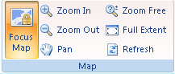

The **Map** group on the **Layout** tab, commands for browsing the map in focus are provided.

  
Figure: The Map group  
  
Commands organized in the Map group include:

[Lock Map](LockMapButton.htm)

[Zoom In](Zoominbutton.htm)

[Zoom Out](Zoomoutbutton.htm)

[Zoom Free](Zoomfreebutton.htm)

[Full Extent](EntireViewbutton.htm)

[Refresh](RefreshMapbutton.htm)

[Pan](PanButton.htm)