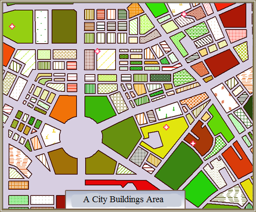

This group uses custom attribute fields to create thematic maps.

You can create custom maps for a point, line, or region layer. Set a layer as the current layer before creating a thematic map for it. To do so, select the layer in the Layer Manager.

Custom maps are suit for representing maps with rich contents and complicated attributes. The following figure simulates the complicated building classification in a city.

  
  
In the legend, the fill with pure color represents public buildings, and the fill with pattern represents private buildings.

Different pure color represents different public buildings, and different pattern represents different private buildings.

The red cross represents hospitals.

### You can create a custom map through:

[New Custom Map](CustomizeMapDefault)

[Modify Custom Map](CustomizeMapGroupDia)

### Related Topics

[Modifying Thematic Maps](../EditingMap/EditingMap)
