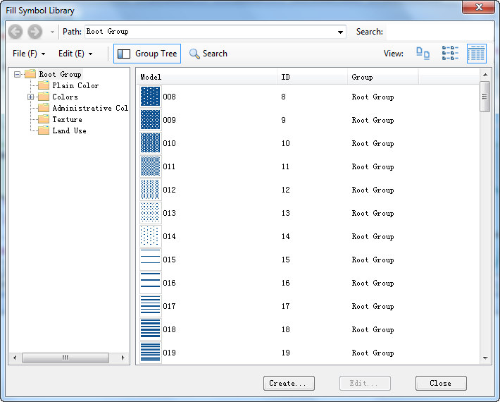

### Introduction

The Custom Map Manager, also called the group dialog box for the Custom group
allows you to change the settings of a custom map for more favorable effects.

### Basic Steps

1. Double click a custom map for a vector layer in the Layer Manager and click the group dialog box button at the bottom right corner of the Custom group.
2. Thematic Map Layer: Display the current thematic map name.

**The settings available in the Thematic Map window are slightly different
when creating customized thematic maps based on point, line, region layers.**

3. Properties: The Properties tab allows you to set fill, line, or marker style for the custom map. Fill style settings are applicable to region objects in region layer-based custom maps. Line style settings are applicable to line objects in line layer-based custom maps and edges of region objects in region-layer based custom maps. Marker style settings are applicable to point objects in point layer-based custom maps. 

Fill Style Settings

  * Fill Symbol: A numeric field or field expression holding the symbol ID. The system symbol with the corresponding ID will be called in to render the object.
  * Opacity: A numeric field or field expression holding the opacity if the symbol used to render the object. The opacity ranges from 0 to 100, with 0 being fully transparent and 100 being fully opaque. If you set the Opacity to a value beyond the range, the symbol would be opaque.
  * ForeColor: A numeric field or field expression holding the color code. The color is used to fill the foreground of the symbol. The field value is firstly converted into a hex value, and then the value is picked according to the hex value. For instance, if the field value is 1000, it will be firstly converted into 3E8, then 0s are added ahead to form a 6-digit number. After that, the number is split into three parts:00, 03, and E8 (232 in decimal), representing the G, B, and R values.
**Note**: When you are editing color field, you can enter hexadecimal color values directly with the feature "[Show Hexadecimal](../../DataProcessing/EditTabular/DisplayHexadecimal)".

  * BackColor: A numeric field or field expression holding the color code. The color is used to fill the background of the symbol. The field value is firstly converted into a hex value, and then the value is picked according to the hex value. For instance, if the field value is 1000, it will be firstly converted into 3E8, then 0s are added ahead to form a 6-digit number. After that, the number is split into three parts:00, 03, and E8 (232 in decimal), representing the the G, B, and R values.
  * Gradient Mode: A numeric field or field expression holding the value representing the gradient mode. 1, 2, 3, 4 respectively represent linear, circular, conical, square, and other values represent none.
  * Gradient Angle: A numeric field or field expression holding the value representing the gradient angle in degrees. The default is 0. A positive value indicates counterclockwise rotation while a negative value indicates clockwise rotation.
  * Offset X: The percentage of the gradient center to the fill center in the horizontal direction. Applicable to conical, square and circular gradient fills. A positive value indicates left offset while a negative value indicates right offset.
  * Offset Y: The percentage of the gradient center to the fill center in the vertical direction. A positive value indicates up offset while a negative value indicates down offset.
* Line Style Settings
  * Line Symbol: A numeric field or field expression holding the symbol ID. The system symbol with the corresponding ID will be called in to render the object.
  * Line Color: A numeric field or field expression holding the color code. The color is used to render the line. The field value is firstly converted into a hex value, and then the value is picked according to the hex value. For instance, if the field value is 1000, it will be firstly converted into 3E8, then 0s are added ahead to form a 6-digit number. After that, the number is split into three parts:00, 03, and E8 (232 in decimal), representing the the G, B, and R values.
  * Line Width: A numeric field or field expression holding the value representing the the line width in 0.1 millimeters.
* Marker Style Settings
  * Marker Symbol: A numeric field or field expression holding the symbol ID. The system symbol with the corresponding ID will be called in to render the object.
  * Marker Color: A numeric field or field expression holding the color code. The color is used to render the point. The field value is firstly converted into a hex value, and then the value is picked according to the hex value. For instance, if the field value is 1000, it will be firstly converted into 3E8, then 0s are added ahead to form a 6-digit number. After that, the number is split into three parts:00, 03, and E8 (232 in decimal), representing the the G, B, and R values.
  * Marker Size: A numeric field or field expression holding the value representing the the marker size in 0.1 millimeters. 0 indicates that the original size will be employed. A negative value indicates that the marker will not be displayed.
  * Rotation: A numeric field or field expression holding the value representing the rotation angle of the marker symbol in degrees. A positive value indicates counterclockwise rotation while a negative value indicates clockwise rotation. The unit is degrees.
* **RGB Color Mode** : The customized filling color, line color, and point symbol color are shown as BGR values by default, and if you check the RGB Color Mode check box, the program will show these colors as RGB color values.

### Note

1. You can save a thematic map you have created as a template for reuse. Please refer to [Save to Thematic Map Template Library](../Methods/DTv2_LoadStyleThemeTempl).
2. The values of field or field expression holding symbol IDs corresponds to symbol IDs in the symbol library. You can open the Marker symbol library to check it. Double click the Marker Symbol Library node under the Resources node in the Workspace Manager.
  

### Related Topics

[Line Symbol Style Settings](../../Visualization/LayerStyle/ManagerUISymStyle)
