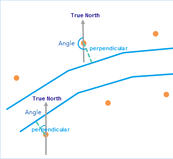

###  Instructions

We can set the rotation of a marker symbol when specifying the style of a
point layer or customizing a thematic map based on a point layer. Points Match
Lines can calculate the perpendicular angle and distance between a point and a
line near to it. Result data will be saved in the attribute table of the point
dataset. You can customize a thematic map based on the point dataset according
to the specified point styles and rotation.

The attribute table includes the following records.

* **New_Line_ID** : The ID of the line object near to each point.
* **Distance** : The distance from a point to the line object near to the point.
* **Coordinates of a foot** (ProjectPoint_X, ProjectPoin_Y): The coordinate X and coordinate Y of a foot of a perpendicular through a point and its adjacent line.
* **Index of segment** (SegmentIndex): the index of the adjacent line segment.
* **Angle** : The angle between true north and the perpendicular line from a point to the near line.

**Theory**

The theory of angle calculation is: calculating the angle between a
perpendicular through a point and its adjacent line and true north in counter-
clockwise direction.

  
  
###  Applications

* Ancillary hydropower station symbols can point to each hydropower station.
* In a three dimensional map, we can make all car symbols along the direction of each parking space.

###  Function entrances

* Thematic Mapping > Custom > Points Match Line Directions.
* Maps > Mapping > Points Match Line Directions.
* Data > Data Processing > Mapping Making > Points Match Line Directions.

###  Parameter introductions

* **Point Dataset** : Specify the point dataset. Markers in this dataset will be rotated toward each line direction.
* **Reference Line Dataset** : Set the reference line dataset. **Note** : the line dataset must use the same coordinate system as the point dataset.
* **Marker Style** : Click on the marker symbol button to open the Marker Symbol Selector where you can specify the marker symbol you want. For more detail about markers, please refer to [Marker Symbol Selector](../../SymManager/SymMarkerSelector). Click on Default to set marker symbol to the default symbol.
* **Maximum Distance** : If the perpendicular distance from a point to a line near to the point is larger than the value, the point won't involve in the calculation.

According to the following figure, we can find out that all cars in the
parking spaces towards correct directions after using Points Match Line
Direction.

  
  
###  Related topics

 [Create a customized thematic map](CustomizeMapDefault)

 [Modify a customized thematic map](CustomizeMapGroupDia)

