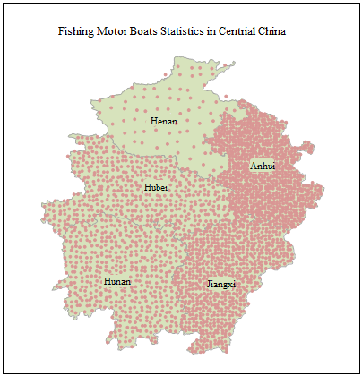

The dot density thematic map is another type of thematic map used to represent
quantities, similar to ranges thematic maps and graduated thematic maps. But
instead of using colors, patterns, or symbol sizes to symbolize, dot density
thematic maps use density of dots to represent the value of an attribute
associated with a region. Each dot represents a number of units, and the
product got by multiplying the number of dots in a region and the units each
dot represents is the value of the attribute of that region.

Click the Dot Density Map in the Thematic Mapping group to create the Dot
Density Map. Click to select a dot density map template for users. Besides,
you can customize the maps through the group dialog box for the Dot Density
group, also called the Dot Density Map Manager. The following figure shows the
power of the motor boats with dot density map.

  
  
You can create label maps for a point, line, or region layer. Set a layer as
the current layer before creating a thematic map for it. To do so, select the
layer in the Layer Manager.

### You can create a dot density map through:

[New Dot Density Map](DotDensityMapDefault)

[Modify Dot Density Map](DotDensityMapGroupDia)
