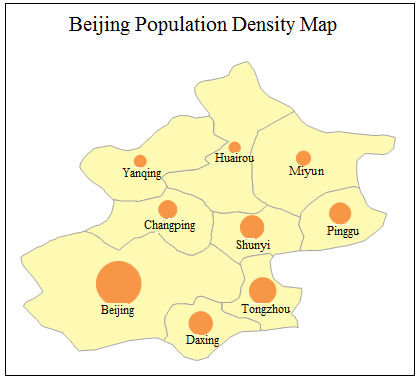

The graduated symbols map uses symbols with different shapes, colors and sizes
to represent the quantity and quality characteristics of each object which is
independent and displayed in an overall concept. Normally, the shape, color
and size of the symbols reflect the specific attributes of the object; the
shape and color represent the quality characteristic, while the size of the
symbol means the quantity feature. The graduated symbols map is mainly used to
the map with the quantity features, such as the classification of the food
production in different regions, GDP, population, etc. It means that the
thematic variable type which is used to make the graduated symbol map is
numeric.

Click the Graduated Symbols button in the Thematic Maps group to create the
system default graduated symbols. Users can set the parameters. Besides, you
can customize the maps through the group dialog box for the Graduated Symbols
group. The following figure shows the population density in Beijing with a
graduated symbols map.

  
  
You can create graduated symbols maps for a point, line, or region layer. Set
a layer as the current layer before creating a thematic map for it. To do so,
select the layer in the Layer Manager.

### You can create a graduated symbols map through:

[New Graduated Symbols Map](GraduatedSymbolMapDefault)

[Modify Graduated Symbols Map](GraduatedSymbolMapGroupDia)
