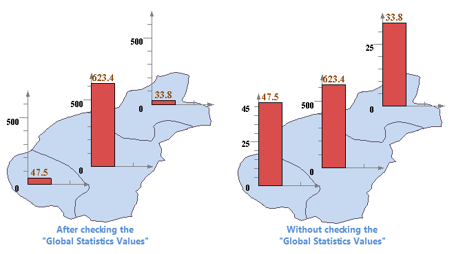

The Properties tab allows you to set the styles of the graph map. The changes
to the map will be instantly shown on the map.

1. The Options Area: Adjusts the display settings of the graph symbols in the graph map. 
* Flow Display: Check the box to display graph symbols in floating mode. If checked, the graph symbols will change positions in the map window for optimal effects. When you opened the flow display, please don't use the partly refreshing function, or the display won't be correct.
* No Overlap: Check the box to display graph symbols as much as possible without overlap. 
* Show Negative: Show graph symbols for negative values.
* Scale with Map Zoom: Check the box to scale the graph symbols with map zoom.
* Leader Lines: Check the box to show lines connecting the graph symbols and the objects if the graph symbols are placed away from the objects. You can set the styles for the leader lines through the Style Settings dialog box that shows up by clicking the Line Style button to the right. 
* Global Statistics Values: Checking the box means all graphs in the thematic map will be shown in the same scale like the left picture shows below. The feature is applicable to represent the comparison between statistical values. 

But if you do not check the box, scales of graphs will be shown as their
properties. There are no relationships between graphs like the right picture
shows below.

  
---  
2. Visible Size Range: The maximum and minimum sizes of the graph symbols. The unit for Visible Size Range is map units. It is recommended that you keep the default values. When you didn't select the **Scale with Map Zoom** , the unit of the fiducial value is 0.01mm. 
* **Enable Expression:** Check the Enable Expression box. You can control the size of the statistical symbol by field values. Also, input the number. The unit is meters.
* Max Size: The maximum size of the graph symbols. When the thematic maps are pie, 3D pie, rose, 3D rose and ring, the Graph diameter is the quarter of the max size. The height of other ThemeGraphs, such as the columnar and area, is the quarter of the maximum display. Other graph symbols are drawn according to the maixmum and minimum symbols. 
* Min Size: The Minimum size of the graph symbols. When the thematic maps are pie, 3D pie, rose, 3D rose and ring, the Graph diameter is the quarter of the min size. The height of other ThemeGraphs, such as the columnar and area, is the quarter of the maximum display. Other graph symbols are drawn according to the maixmum and minimum symbols. 
3. Offset Settings Area: Controls the distances the graph symbols are placed from the objects. 
* Offset X: The horizontal graph symbol offset. You can directly type a value in the combo box or select a field from the list.
* Offset Y: The vertical graph symbol offset. You can directly type a value in the combo box or select a field from the list.
* Offset Unit: Set the unit with which the offsets will be measured. The graph symbol offset distance can be measured in map units or 0.1 millimeters. 
4. Graph Labels Area: Specified whether to display graph labels in the graph map or not. Check the box to show graph labels and enable the Label Format and Label Style buttons. 
* Label Format: The format of the graph symbol labels. The options provided include: Percentage, Value, Label, Label + Percentage, and Label + Value.
* Label Style: The style of the graph symbol labels. Click the button to the right to display the label style settings dialog box and set the graph symbol label style in it.
5. Axis Options Area: Specifies whether and how to display the axes. The Axis Options settings are applicable to Area, Step, Line, 3D Line, Bar, 3D Bar, Stacked Bar, 3D Stacked Bar, etc. 
* Axis Color: The color of the axes. Click the button to the right to display the color panel and specify a color for the axes.
* Labeling Mode: How the axes will be labeled. You can choose to label both axes, Y axis only, or none. By default, both axes are labeled.
* Label Style: The style of the text labels for axes. Click the button to the right to to display the color panel and specify a color for the labels of axes.
* Show Axis Grid: Check the box to show axis gridlines.
6. **Bar Settings Area:**
* Bar Width Factor: The width of each bar. The default is half the max width for the graph map. You can specify a value ranging from 0 to the max width. The unit is map units. The Bar Settings are applicable to Bar, 3D Bar, Stacked Bar, and 3D Stacked Bar graphs.Rose and Pie Settings.
* **Bar Space Factor:** Used to set the spacing between the bars, 
7. Rose and Pie Styles: Set angles. 
* Start Angle: The start angel of the Pie/Rose graph. The default is 0, the positive direction of the X axis. The Start Angle setting is applicable to Pie, 3d Pie, Rose, and 3D Rose graphs.
* Rose Angle: The angle of each sector. The default is 0. If you set Rose Angle to 0 or greater than 360 degrees, the angle of each sector will be 360/Number of sectors.
8. When changing the settings in the Thematic Map Manager, all changes for the thematic map are instantly shown on the map. To prevent instant refresh, uncheck the Enable instant refresh box. If the thematic map is not instantly refreshed during the modification, click Apply at the bottom to apply all changes to the thematic map when the modification is done. 

### Note

1. You can save a thematic map you have created as a template for reuse. Please refer to [Save to Thematic Map Template Library](../Methods/DTv2_LoadStyleThemeTempl).
2. After saving to the template library, the template will be displayed in the Templates drop-down list in the Graph on the Thematic Mapping tab and you can apply it to other thematic maps.

### Related Topics

[Modifying Graph Maps](GraphMapDia)

[The Properties tab](PropertiesDia)

