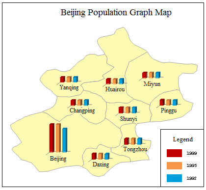
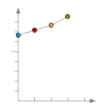
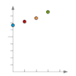
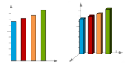
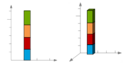
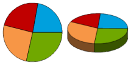
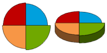
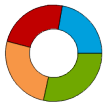

The graph map draws charts for each element or record to reflect the
corresponding thematic value. Unlike other thematic maps, the Graph maps have
their own unique features. Graph maps are usually used to show demographic
information, for example, GDP, Crop product, and population of each state.
More than one thematic variable can be displayed in each graph. You can also
compare these thematic variables across the entire map.

Graph maps employ more than one fields so that the graph result can be
analyzed horizontally and vertically. In addition, graph map is the unique
thematic map that more than one variables can be used together.

Click "Thematic Mapping" tab > "Graph" group > "Graph" drop-down button, and
then you can choose any diagrams from the drop-down list as needed.

The selectable templates are: Default, Population density comparison_bar, Age
structure_3D Rose and 1st industry increase_3D bar. Besides, you can customize
the maps through the group dialog box for the Graph group, also called the
Graph Map Manager. The figure below is a graph map of Beijing population. Each
color represents a population in a year.

  
---  
  
Thirteen types of charts are provided:

Name | Illustration | Features  
---|---|---  
Line || A line chart or line graph is a type of chart, which displays information as a series of data points connected by straight line segments.  A line chart is often used to visualize a trend in data over intervals of time. Thus the line is often drawn chronologically.  
Point || A point chart is a type of chart, which displays information as a series of data points.   A point chart is often used to visualize a trend in massive data.  
Histogram and 3D Histogram || A histogram is a graphical representation showing a visual impression of the distribution of data.   A histogram consists of tabular frequencies, shown as adjacent rectangles, erected over discrete intervals (bins), with an area equal to the frequency of the observations in the interval. The height of a rectangle is also equal to the frequency density of the interval.  
Stacked Bar and 3D Stacked Bar | | A bar chart is a chart with rectangular bars with lengths proportional to the values that they represent. Bar charts are used for marking clear data which has discrete values.    A bar chart is very useful for recording certain information whether it is continuous or not continuous data.  
Pie and 3D Pie || A pie chart is a circular chart divided into sectors, illustrating proportion.    In a pie chart, the arc length of each sector (and consequently its central angle and area), is proportional to the quantity it represents.  
Rose and 3D Rose || A rose chart is proportional to the quantity that field values represent.  Different from the pie chart, in rose chart, the angle is fixed, but the radius changes as the field value varies.  
Ring || A ring chart is also a circular chart divided into sectors, illustrating proportion.    In a ring chart, the arc length of each sector (and consequently its central angle and area), is proportional to the quantity it represents.  
  
You can create label maps for a point, line, or region layer. Set a layer as
the current layer before creating a thematic map for it. To do so, select the
layer in the Layer Manager.

Note that when creating the graph map, the size is determined by the field
expression corresponding to this object. So there may be the different sizes
of graph maps, but they have the same fields.

### You can create a graph map through:

[New Graph Maps](GraphMapDefault)

[Modifying Graph Maps](GraphMapDia)

