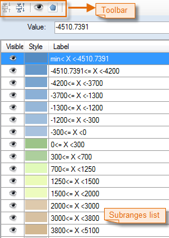

### Introduction

The Grid Ranges Map Manager, also called the group dialog box for the Grid
Ranges group allows you to change the settings of a grid ranges map for more
favorable effects. When changing the settings in the Grid Ranges Map Manager,
all changes for the thematic map are instantly shown on the map.

### Basic Steps

1. Select a grid ranges map for a grid layer in the Layer Manager and right click the Modify Thematic Map. The Grid Ranges Map dialog box display the selected Grid Ranges Map settings.
2. Thematic Map Layer: Display the current thematic map name.
3. Method: You can use the following classification methods to classify your quantitative data. You can click the Method drop-down arrow to choose a method. The standard deviation and quantile classification methods are not supported for grid ranges maps.
* Equal Interval: This classification method divides the range of attribute values into equal-sized subranges (classes), allowing you to specify the number of intervals while SuperMap Deskpro .NET determines where the breaks should be.
* Square Root: This classification method first divides the range of the square roots of all attribute values into equal-sized classes, then calculates the squares of the breaks and uses the squares to classify the attribute values.
* Logarithm: This classification method first divides the range of the logarithms of all attribute values to base 10 into equal-sized subranges, then calculates the exponents of all breaks and uses the exponents to classify the attribute values.
* Defined Interval: This classification method allows you to specify an interval by which to equally divide a range of attribute values. Rather than specifying the number of intervals as in the equal interval classification method, with this method, you specify the interval value. SuperMap Deskpro .NET automatically determines the number of classes based on the interval.
4. Classes: How many subranges (classes) you want to classify the range of attribute values into.
5. Interval: The interval by which to equally divide a range of attribute values. This item is only active if you select the defined interval classification method to classify the attribute values.
6. Label Format: The format of the labels for the items in the subranges list.
7. Color Ramp: The range of colors you want to apply to the range of thematic values.
8. **Settings of special values** : Set display effect for some raster pixels with special value. 
* **Special Value** : You can click  button, then pick up a pixel value as a special value in the current window, also you can enter a value in Special Value box as a special value. 
* **Special Style** : Set the display color of grids with specified value. Click "Special Style" color box, and then in the pop-up panel, select a color as the display color of grids.
* **Special Value Transparent Display** : Specify whether to make the grids with special value transparent. Checking the checkbox means yes.

* Merge and Split: Merge and split subranges according to your needs. 
* The **Merge** icon merges multiple continuous ranges into one range. The icon is active when you have selected multiple continuous ranges.
* The **Split** icon is used to split the selected subrange into two ranges.
* Visible: The Visible button  on the toolbar in the Grid Ranges Map Manager or the icon  next to the item in the subranges list lets you control the visibility of the cells with values within the selected subrange.
* Click the Visible button to show or hide the cells with values within the selected subranges.
* You can also click the icon  in the subranges list to control the visibility of the cells with values within corresponding subrange.
* Style: The Style button  on the toolbar in the Grid Unique Values Map Manager lets you set the color to fill the cells with the selected items. You can also open the color panel to set the fill color by selecting an item and clicking the corresponding style icon  in the thematic values list. In the color panel, you can directly select a color or click More Colors at the bottom to define one.
* Value: The end value of a subrange. You can change the value by clicking the up and down arrows to the right or directly typing a value and press enter to see the refreshed grid ranges map.
* Label: The label for the thematic value, as shown in the blue box in the figure above. To set a label editable, select a subrange and click its label.
* When changing the settings in the Ranges Map Manager, all changes for the thematic map are instantly shown on the map. To prevent instant refresh, uncheck the Enable instant refresh box. If the thematic map is not instantly refreshed during the modification, click Apply at the bottom of the 3D Ranges Map Manager to apply all changes to the thematic map when the modification is done.

### Note

1. You can save a thematic map you have created as a template for reuse. Please refer to [Save to Thematic Map Template Library](../Methods/DTv2_LoadStyleThemeTempl) for specific operations.
2. After saving to the template library, the template will be displayed in the Templates drop-down list in the Graph on the Thematic Mapping tab and you can apply it to other thematic maps.

