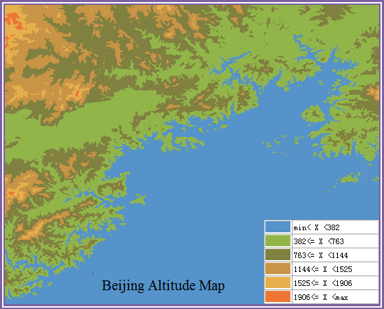

When the current layer is the grid layer, click Ranges Map in the Thematic
Maps to select templates to create grid ranges map. Besides, you can customize
the maps through the group dialog box for the Grid Ranges group, also called
the Grid Ranges Map Manager.

You can create grid ranges maps for a point, line, or region layer. Set a
layer as the current layer before creating a thematic map for it. To do so,
select the layer in the Layer Manager. The following figure shows the grid
ranges map on Beijing elevation contours.

  
  
From the figure we can see different ranges of elevation using different colors.

### You can create a grid ranges map through:

[New Grid Ranges Map](GridRangesMapDefault)

[Modify Grid Ranges Map](GridRangesMapGroupDia)

