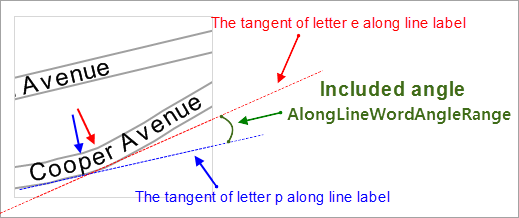
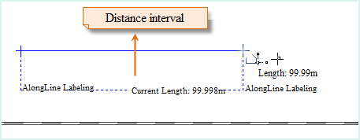
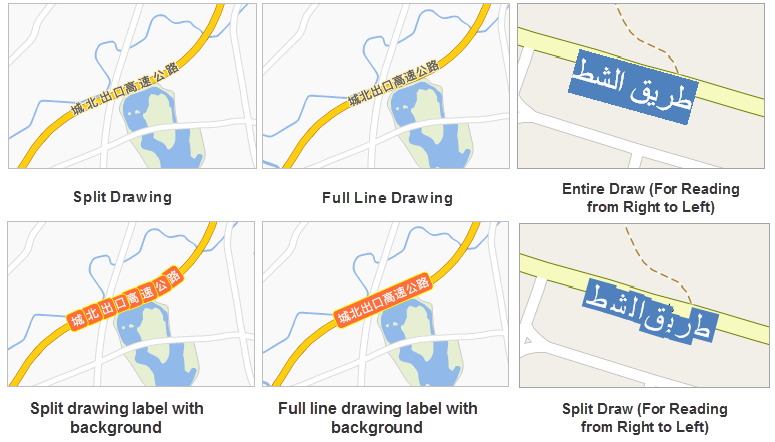
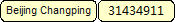
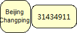
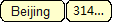

The Advanced tab provides access to advanced display setting for labels (text
objects). The changes to the thematic map settings will be instantly shown on
the map.

* **Alongline Settings Area**
* **Alongline Labeling** : Check to place a label along line. The settings in the Alongline Settings area are only available if you check this box and the current label map is created based on a line layer. 

Alongline Labeling is the precondition for the following items.

* **Fixed Text Angle** : Check the box to keep all labels in the map in vertical direction.
* **Label Direction** : Set the label direction along the relevant line. Five options are provided: 

Along the normal of the line: From bottom to top, left to right; From top to bottom, right to left; From
bottom to top, right to left; From top to bottom, right to left. SuperMap
Deskpro .NET will first judge the direction, whether it is horizontal or
vertical (judgment criterion: if the angle between a line and the horizontal
direction is less than 60 degrees, this line direction is regarded as
horizontal, otherwise vertical); for the horizontal direction, the label is
placed from left to right or from right to left; for the vertical direction,
the label is placed from up to down or from down to up.

**Note** : You are not allowed to set label direction if the Fixed Text Angle
box is checked.

* **Spacing** : The spacing between two neighboring words. The value ranges from 1 to 8.
* **World Angle Along Line:** Set the maximum Angle of adjacent words or letters to guarantee the beauty. The value range is [0,90]. The angle is smaller, the label is tighter, as shown below.
  

* **Interval Unit** : It is used to specify the unit of repeat interval. Click the drop down button to select coordinate system unit or 0.1 mm. 0.1 mm indicates the unit of repeat interval is 0.1 mm; coordinate system unit indicates that the unit of repeat interval is identical to map unit.
* **Repeat Interval** : When the line object is overlong, you can label the line one time at each certain distance. You can set the repeat label distance here. The repeat length refers to the front of the former label to the front of the next one (or the back of the former label to the back of the next one). The unit of repeat interval is consistent with the unit of map.
  
* **Draw Type:** Set the mapping strategy of the along line drawing. Provide five types: 
* **Compatible Draw:** From SuperMap GIS 8C(2017), adjust the drawing strategy of along line standard. If the thematic map is made by the previous version, and you want to display the original format, it is recommended to select the "compatible map" option.
* **Entire Draw:** Regard the label as a whole. Commonly used in the along line label with the background.
* **Split Draw:** Split the Chinese and English characters.
* **Entire Draw (For Reading from Right to Left):** Draw each label with words being shown from right to left. But you are required to set Font to a western font like Times New Roman and Label Direction to Along the normal of the line to make the resulting labels correct.

* **Split Draw (For Reading from Right to Left)** : Draw each label with words being split and shown from right to left.But you are required to set Font to a western font like Times New Roman and Label Direction to Along the normal of the line to make the resulting labels correct.

The effect as shown in the figure below.

* **Label Length Settings Area:**
* **Overlength** : Set the method to deal with overlength. Three options are provided: Default, Omit, and Wrap.

Methods | Description | Illustration  
---|---|---  
Single Line Display| All texts are displayed in a single line. |   
Wrap| If the label exceeds the maximum length, the system will display them in another line. |  
Omit| If the label exceeds the maximum length, the system will omit the characters exceeded. |  
  
**Note**: If AlongLine Labeling is checked, this function isn't available.

* **Specify Line Feed Character:** Click the right dropdown button of the label control and select a symbol as a line break. The text label will show the newline characters.
* **Length Limit** : The number of characters for a single line. An English word will not be broken even if the label is too long and needs to be wrapped. The whole world will be displayed at the end of the previous line. The Normal Length setting is only available if you choose to wrap the text to fit the or omit the part beyond the length limit.

* **Text Alignment:** If the the overlength processing type is set to wrap, you can set text alignment type here. Supported text alignment types are: center, align left, align right, and distributed.
* **Multiline text automatic alignment after avoiding:** Check this box, then you can make the text automatic alignment after avoiding.
* **Label Height Range Area**
* Max Height: The maximum height of a label. The label will not zoom in with the map if the label reaches the max height.
* Min Height: The label will not zoom out with the map if the label reaches the min height.

Note: When setting the minimum and maximum text height, you need to uncheck
the Fixed Size, otherwise, the limits of the text height is invalid.

* **Label Width Range Area**
* Max Width: The maximum width of a label. The label will not zoom in with the map if the label reaches the max width.
* **** Min width: The label will not zoom out with the map if the label reaches the min width.
* **Avoid Overlap Settings**
* **Horizontal Buffer** : Filter out the labels within the horizontal buffer. The unit for Horizontal Buffer is identical to Offset Unit you specified. The unit for Vertical Buffer is identical to Offset Unit you specified.
* **Vertical Buffer** : Filter out the labels within the vertical buffer. The unit for Vertical Buffer is identical to Offset Unit you specified.
