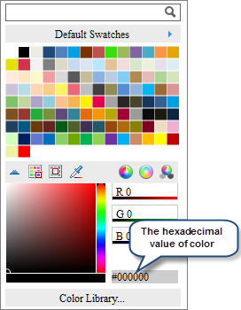
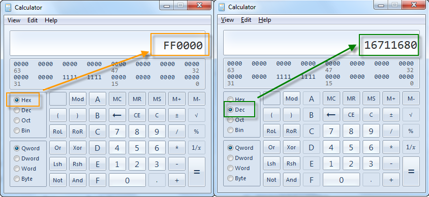
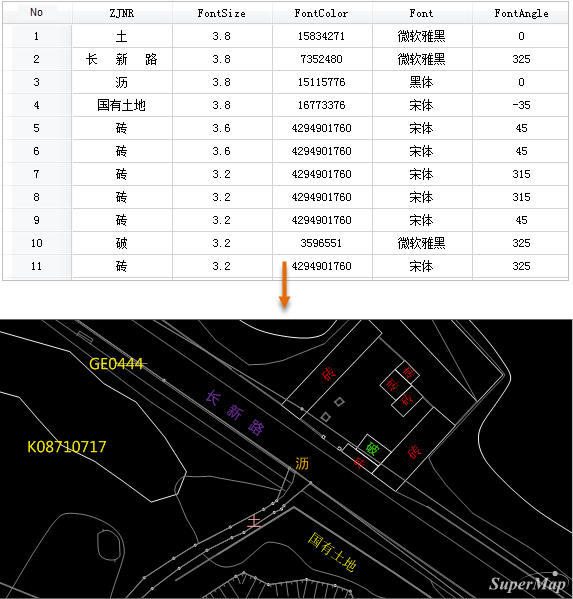

### Introduction

It realizes displaying different types of labels on font, size, rotation angle
and color in a thematic map. E.g, when importing CAD data, make a custom label
thematic map for the point dataset which includes text information to realize
the same text display effect in CAD. Note: the point, line, region datasets
all support making custom label thematic map, but the custom thematic map of
the line dataset doesn't support setting along line. Only for the point label
thematic map it supports setting label style by the field.

  
  
### Note

To use the field to assign the font style, the field should follow some
requirements.

1. Font name: the field type can be text type, the field value the font name such as Arial; if the field value doesn't correspond to the font name in the system, it will be set according to the condition not using expression. 
2. Font size: the field type can be integer, and the field value is the font hight with the unit as mm. If the field value is empty, it will use the default 4mm.
3. Rotation angle: The field type is numeric, and the field value is angle, in degrees. The counterclockwise of the angle is positive, and the value is positive; the clockwise of the angle is negative, and the value is negative. If the filed is null, it will use the default 0 degree.
4. Font color: the field type is integer, and the field value is decimal color value. If the field is null, it will use the color without setting the expression.

Select a color on the color panel, the color is in hex, and copy the last six
digits of the value to the hex value mode in the calculator, and then convert
it to the decimal. In this case, this value can be placed into the attribute
table.

  
---  
  
  
Besides the font name, the font size, rotation angle, font color all can be
set by the direct inputed value.

The following is an example of the attributes content and the corresponding
label display effect.

  
