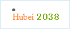
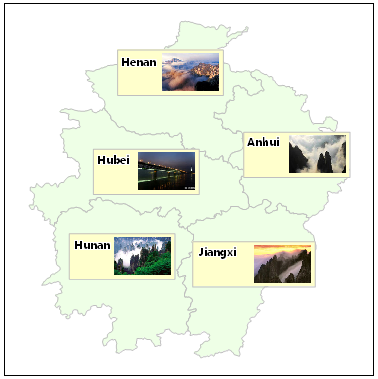

Label maps are used to annotate point, line, or region objects on the map with
text or numbers. For example, you can create a label map for a river dataset
to annotate the rivers with their names or lengths on the map.

Labels enrich map information. Label thematic mapping facilitates to annotate
information on a map. Labels can be created according to attributes, and can
be placed into proper positions. To avoid label overlapping, the function of
Move Label is necessary.

There are four types of label maps: Uniform, Ranges, Composite and Matrix.
Select a vector layer in the layer manager. Right click ans select the Create
Thematic Maps in the context menu. Click Label Map in the list to create a
label map of the corresponding type, as shown below:

* [Uniform Label Maps](UniformLabelMap): On these maps, all the values of a specified layer expression are displayed with a unified style.
* [Unique Value Style](UniqueLabelMap): Divides the values of the specified field expression into several classes, and the object labels with the same value will use the same style. Among them, a unique value corresponds with a unique thematic map item. 
* [Ranges Label Maps](RangesLabelMap): For this type, you should specify a numerical field for ranging. Every range has a single label style.
* [Composite Label Maps](MixedLabelMap): Labels are grouped by positions or separators. Every separate part has a single label style. For example, "ABC 3028" can be divided into 2 groups: ABC and 3208.  
  
  * By position: The cell is 2, which indicates that the label is divided into two parts. The number 2 between part1 and part 2 indicates that the first part contains 2 characters (from beginning), and the rest is the second part. The two parts have different label styles. 
  * By separators: Labels are separated by a specified separator. This separator can be number, character, underline, space, etc. The maximum is 5 parts. Each part has a single style. 
* [Label Matrix Maps](LabelMatrixMap): The annotation is a label matrix which contains elements of symbols, pictures and text. Meanwhile, a label matrix can be nested to another label matrix. So it is very suit for representing complicated information. e.g. weather report, tourism information, etc. The following figure is a label matrix map.    

### Two methods for creating lable maps:

[Create label map](LabelMapDefault)

[Modify label map](LabelMapDia)

