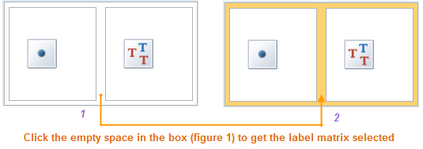
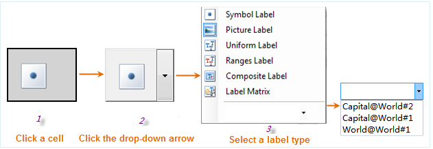

### Introduction

The Label Matrix Map Manager, also called the group dialog box for the Label
group allows you to change the settings of a label matrix map for more
favorable effects.

### Basic Steps

1. Select a label matrix map for a vector layer in the Layer Manager and click the group dialog box button at the bottom right corner of the Label group.
2. Thematic Map Layer: Display the current thematic map name.

### Below is the default Label Matrix Map Manager with the label matrix
unselected. The Properties tab allows you to set the columns and rows.

  * Columns and Rows: The default label matrix has 2 columns and 1 row. You can change the columns and rows based on your needs.  
    

* Click the empty space in the box (figure 1) to get the label matrix selected (figure 2). The Columns and Rows become editable.
* You can directly type values in the text boxes and press Enter to change the columns and rows of the label matrix. Also, you can click the up and down arrows to change the columns and rows.

When the label matrix is selected, two tabs show up below: the Properties tab and the Advanced tab.

* The Properties tab: Set the basic display parameters for the matrix label.

[The Properties Tab](PropertiesDia)

* The Styles tab: Set the display parameters for selected matrix label.

[The Styles Tab](LabelMatrixMapSty)

[The Advanced Tab](AdvancedDia)

When you select a cell of the label matrix, the corresponding tabs are displayed below. For different types of cells, the tabs for parameter settings are different.

* Label type settings for a cell: Click to select a cell in the label matrix (figure 1), a drop-down arrow shows up (figure 2), click the drop-down arrow to display the label type list for the cell. You can directly select a label type from the label type list. Also, you can click the drop-down arrow at the bottom of the list to select a label map from the list to apply the label type of the thematic map to the cell. All label maps in the workspace are listed in the drop-down list (figure 3). 
  
  
**The label types are:**

**Symbol Label**

If you set the label type of a cell to symbol label. The corresponding cell of
the label on the label map displays a symbol. Meanwhile, the related commands
show up below for symbol label settings.

A cell of symbol label type displays a symbol at the corresponding position.

* Symbol ID: The IDs of the symbols you want to place in the cells of the matrix labels. All fields of the dataset referenced by the vector layer are listed in the drop-down list. 
  * You can specify a field storing the symbol IDs.
  * Also, you can type a symbol ID to apply the symbol to all labels.
* Size: The size of the symbols in millimeters. You can click the up and down arrows to change the value or directly type a value in and press Enter. The changes will be instantly shown on the label map.
* Color: The color of the symbols. Click the drop-down arrow to the right to display the color panel, in which you can select a color or click More Colors to define one.
* Rotation: The rotation angle of the symbols in degrees. You can click the up and down arrows to change the value or directly type a value in and press Enter. The changes will be instantly shown on the label map.ShowPicture Label

**Picture Label**

If you set the label type of a cell to picture label. The corresponding cell
of the label on the label map displays an picture. Meanwhile, the related
commands show up below for picture label settings.

A cell of picture label type displays a picture at the corresponding position.

* Path: The paths of the pictures you want to place in the cells of the matrix labels. All fields of the dataset referenced by the vector layer are listed in the drop-down list. 
  * You can specify a field storing the relative or absolute picture paths.
* Size Unit: The unit for the picture size settings. You can set it to either the map units or millimeters.
* Rotation: The rotation angle of the pictures in degrees. You can click the up and down arrows to change the value or directly type a value in and press Enter. The changes will be instantly shown on the label map.
* Keep original size: Check the box to keep the original size of the specified pictures. If this box is checked, you are not allowed Width and Height of the pictures.
* Width: The width of the pictures displayed in the label cells. You can click the up and down arrows to change the value or directly type a value in and press Enter. You are allowed to set the width of the pictures only if the Keep original size box is unchecked.
* Height: The height of the pictures displayed in the label cells. You can click the up and down arrows to change the value or directly type a value in and press Enter. You are allowed to set the height of the pictures only if the Keep original size box is unchecked.

**Uniform Label**

If you set the label type of a cell to uniform label. The corresponding cells
of the labels on the label map displays uniform labels. Meanwhile, the related
tabs show up below for uniform label settings.

The uniform label cell settings on the Styles, Properties and Advanced tabs
are similar with the label settings for the uniform label map in the

[Uniform Label Map Manager](UniformLabelMapDia).

**Ranges Label**

If you set the label type of a cell to ranges label. The corresponding cells
of the labels on the label map displays ranges labels. Meanwhile, the related
tabs show up below for ranges label settings.

The ranges label cell settings on the Styles, Properties and Advanced tabs are
similar with the label settings for the ranges label map in the

[Ranges Label Map Manager](RangesLabelMapDia).

**Composite Label**

If you set the label type of a cell to composite label. The corresponding
cells of the labels on the label map displays composite labels. Meanwhile, the
related tabs show up below for composite label settings.

The composite label cell settings on the Styles, Properties and Advanced tabs
are similar with the label settings for the composite label map in the
[Composite Label Map Manager](MixedLabelMapDia).

Label Matrix

If you set the label type of a cell to label matrix. The corresponding cells
of the labels on the label map displays label matrices. Meanwhile, the
Properties and Advanced tabs show up below for label matrix settings. Please
refer to [The Properties Tab](PropertiesDia) and [The Advanced
Tab](AdvancedDia).

A label thematic map layers

If you click the drop-down arrow in the label type list of a cell and select a
label map to apply the label type of the thematic map to the cell, the labels
of the selected thematic map will be display in the corresponding cells of the
labels on the current label map. Meanwhile, the corresponding tabs shows up
below for settings to the label styles of the selected label map.

3. When changing the settings in the Label Matrix Map Manager, all changes for the thematic map are instantly shown on the map. To prevent instant refresh, uncheck the Enable instant refresh box. If the thematic map is not instantly refreshed during the modification, click Apply at the bottom of the 3D Ranges Map Manager to apply all changes to the thematic map when the modification is done. 

### Note

1. You can save a thematic map you have created as a template for reuse. Please refer to [Save to Thematic Map Template Library](../Methods/DTv2_LoadStyleThemeTempl).
2. After saving to the template library, the template will be displayed in the Templates drop-down list in the Graph on the Thematic Mapping tab and you can apply it to other thematic maps.
3. While setting the path field of the picture label, the path must be a relative path.
4. Matrix label thematic map can display the superscripts and subscripts. Please refer to the introductions for [Unify Styles for ThemeLabel](../LabelMap/PropertiesDia) and [ThemeRange](../LabelMap/PropertiesDia).

