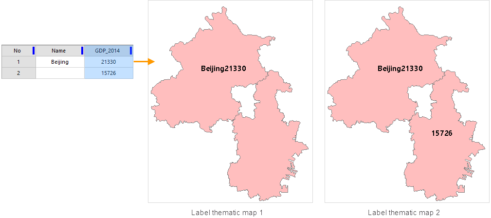
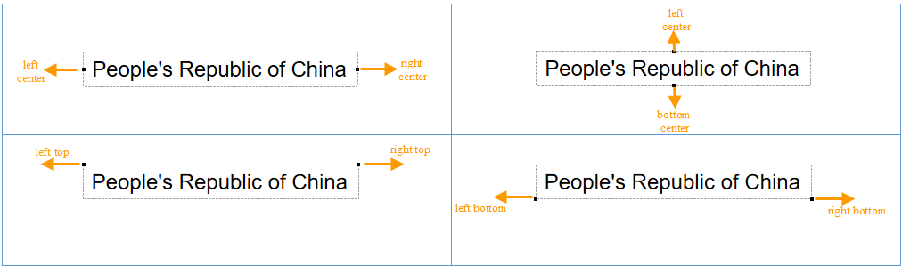
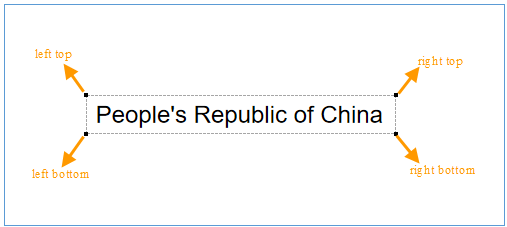
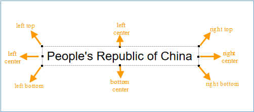

The Properties tab is used to set parameters for label maps. The Properties
tab in uniform label maps, ranges label maps, composite label maps and custom
maps are the same.

* **Expression**

Specify the thematic variable used to label objects. The thematic variable can
be a field or a field expression.

* All fields of the dataset referenced by the vector layer are listed in the Expression drop-down list. You can click a field in the drop-down list or directly type a field and press Enter to label the objects in the vector layer with the new thematic variable. 
* Besides, you can click Expression... in the Expression drop-down list to display the [SQL Expression](../../Query/SQLDia) dialog box and compose a thematic variable with the fields, operators, and function provided. If you apply the newly composed thematic variable to the label map, the objects in the vector layer are labeled with the new thematic variable.

Label Map Expression Description

<table class="normaltable" width="85%">
      <thead>
        <tr class="normaltableTitle">
          <td width="10%">Symbols</td>
          <td width="20%">Definition</td>
          <td width="20%">Engines Supported</td>
          <td width="50%">Instance</td>
        </tr>
      </thead>
      <tr class="normaltablecontent1">
        <td>+</td>
        <td>Hyphen</td>
        <td>Support UDB and SQL datasources</td>
        <td>
Format: Filed name 1 + Field name 2 + Field name 3...

			
Field type: Text, character

			
Sample: NAME + ENAME
</td>
      </tr>
      <tr class="normaltablecontent2">
        <td>||</td>
        <td>Hyphen</td>
        <td>Support UDB, Oracle datasources</td>
        <td>
Format: Field name 1 || Field name 2 || Field name 3||...

			
Field type: Text, character or numeric

			
Sample: NAME || GDP_2000</td>
      </tr>
	    <tr class="normaltablecontent1">
        <td>[/]</td>
        <td>Fractional</td>
        <td>Support UDB, Oracle datasources</td>
        <td>
Format: Field name 1 [/] Field name 2 

			
Field type: Text, character or numeric

			
Sample: NAME [/]  POP_1990 || 'ten thousand people'
</td>
      </tr>
      <tr class="normaltablecontent2">
        <td>chr(10)</td>
        <td>Line break</td>
        <td>Support UDB, Oracle datasources</td>
        <td>
Format: Field name 1 || chr(10) || Field name 2.."

			
Field type: Text, numeric, character

			
Sample: BaseMap_R.NAME || Chr(10) || BaseMap_R.POP_1999
</td>
      </tr>
      <tr class="normaltablecontent1">
        <td>char(10)</td>
        <td>Line break</td>
        <td>Support SQL datasources</td>
        <td>
Format: Field name 1 + char(10) + Field name 2..."

			
Field type: Type

			
Sample: NAME + Char(10) + POP_1999
</td>
      </tr>
      <tr class="normaltablecontent2">
        <td>chr(45)</td>
        <td>Bland character</td>
        <td>Support Oracle datasource</td>
        <td>
Format: Field name 1 || chr(45) || Field name 2..."

			
Field type: Type

			
Sample: NAME || Chr(45) || NAME
</td>
      </tr>
      <tr class="normaltablecontent1">
        <td>char(45)</td>
        <td>Bland character</td>
        <td>Support SQL datasource</td>
        <td>
Format: Field name 1 + char(45) + Field name 2..."

			
Field type: Type

			
Sample: NAME + Char(45) + NAME
</td>
      </tr>
	  <tr class="normaltablecontent2">
        <td>str()</td>
        <td>Convert numeric value to string</td>
        <td>Support SQL datasource</td>
        <td>
Format: str(field name)

			
Field type: Text, character or numeric

			
Sample: NAME + ':' + Str(POPU) + ' 0000 people' 
</td>
      </tr>
	  <tr class="normaltablecontent1">
        <td>to_char()</td>
        <td>Convert numeric value to string</td>
        <td>Support Oracle datasource</td>
        <td>
Format: to_char(field name)

			
Field type: Text, character or numeric value

			
Sample: NAME [/] 'area: ' || to_char( SMAREA)
</td>
      </tr>
	</table>

**Note:**

* When the field expression composes of multiple fields with at least one text field involved, the thematic labels can't be displayed normally as the following label thematic map 1 shows if some value of the text filed is null. The reason is that the SQL expression doesn't support the null-value operation. 
* In this situation, we suggest you determine whether there are null values in all text fields when constructing a SQL expression. If there are null values, return null strings to make labels display normally. Such as we can enter the expression ifnull(Name,"") || GDP_2000. Among them, ifnull (applies for MySQL expressions) is used for determining whether the Name field value of each object is null. If no, returns the value, otherwise, returns the value included in "" (here is a null string). You are allowed to enter any functions according to the actual situation.
  

* While creating thematic maps based on Oracle Plus, SQL Plus engine data, field expression can only be field values or field operations, such as SmID, SmID + 1, etc. Currently, condition expression is not supported. If the field expression is a condition expression, such as SmID > 100, thematic mapping will fail.
* **Background Settings**
Define the background shape and style of the labels.

**Shape** : Set the background shape of the labels. The options are:

* **Default** : Without background shape.
* **Rectangle, Round Rectangle, Ellipse, Diamond, Triangle** : Use the corresponding shape.
* **Marker** : Use a marker as the background shape.

**Style** : Set the background styles of objects. If objects are rectangles,
round rectangles, ellipses, diamonds or triangles, the [Fill Style
Settings](../../Visualization/LayerStyle/FillSymStyle) pops up; if
objects are points, [Marker Style
Settings](../../Visualization/LayerStyle/PointSymStyle) pops up.

**Margin:** Used to set the distance between the text and the background.
Inout the value directly. The unit is pixel. **Note** : Only when the
background is set as the rectangle or the round angle rectangle. When the
background style is set to System 0 or System 1, the background margin.

* **Offset Settings**

Control the distance the label is placed from the object.

* **Offset Unit** : Set the unit with which the offset will be measured. The label offset distance can be measured in map units or 0.1 millimeters.
* **False Easting** : The horizontal offset of each label relative to each object. You can directly type in a value or select a numeric field from the drop-down list.
* **False Northing** : The vertical offset of each label relative to each object. You can directly type in a value or select a numeric field from the drop-down list.

Note: When setting the offset by specifying the field, it is only valid for
the point label map.

* **Effect Settings**

Adjusts the display effects of the labels.

* **Flow** : Check the box to display labels in floating mode. If checked, the labels move with the map window for optimal effects. When opened the flow display, please don't use the partly refreshing function, or the display effect will be incorrect. Note: When using the point layer to create the ThemeLable, it doesn't support the flow display.
* **Superscripts/Subscripts** : Select this check box, and iDekstop will implement the display effect of the superscripts and subscripts according to the rules set in the label expression.
  * Superscripts/Subscripts can't be shown along line, rotated, or wrapped.
  * A label expression with any separator can't work on superscripts/subscripts. 
  * You can't add either a strikethrough or an underline on a superscript or a subscript.
See [**Show Superscripts and Subscripts**](../TextExpression) for more
information.

* Show Slivers: Check the box to display labels for all objects, even small ones. Otherwise, the labels for certain small objects will be filtered out based on the scale.
* **Dispaly Words Vertically:** Check the box to display words in every label vertically. **Note** : If either Alongline Labelling or Rotation has been checked, here the setting will not take effect.
* **Label Always Top:** Check this box and make the label appear above. When using the layer group, the label layer can be covered by the other layer group in the top layer. In order to keep the layer group status and make the label not cover, you can check this attribute. If multiple layers are set this attribute, the display order is determined by the layer.
* **No Overlap** : Check the box to display labels as much as possible without overlap. You can choose to avoid at all directions or four directions.
  * **Avoid at two directions:** Check the box to adjust each label at two directions of related objects. If the alignment type is top left, then the system will calculate whether the top right is overlapped or not. If not, the result will employ this alignment type.
  

  * **Avoid at four directions:** adjust each label at four directions of related objects as a certain order (left bottom, left top, right bottom, and right top) to avoid overlapping each other.
  

  * **Avoid at eight directions:** adjust each label at eight directions of related objects as a certain order (left bottom, left center, left top, top center, bottom center, right bottom, right center, and right top) to avoid overlapping each other.
  

 * **Avoid Around Text:** Adjust each label at any directions surrounding related objects to avoid overlapping.
* **Leader Lines** : Check the box to show lines connecting the labels and the objects if the labels are placed away from the objects. You can set the styles for the leader lines through the Style Settings dialog box that shows up by clicking the Line Style button to the right. To know how to set line styles, please refer to [Line Symbol Style Settings](../../Visualization/LayerStyle/LineSymStyle).
* **Precision** : Set the number of decimal places of the numeric values displayed as labels. The command is only active if the thematic variable is a numeric field. By default, the labels display the original numeric values. You can change the precision by selecting an option from the drop-down list. For example, if you set the Precision to 0.1, the label 178.3129 will display as 178.3 on the label map.

### Note

* When Flow, Show Slivers or No Overlap is checked, "Enable instant refresh" is not recommended to be checked, if enabled, the edge label of the map may appear incomplete. 

