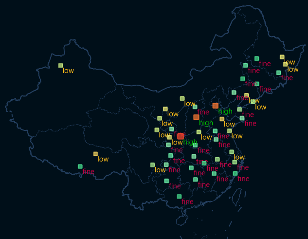

---
id: UniqueStyleDia
title: Styles tab
---  

**Styles tab** is used for setting the text styles of unique label thematic
maps.

1. **Expression:** specify the thematic variable which can be a field or an expression. The objects with the same value will have text labels with the same styles. 
  * All available numerical fields are listed in the drop-down list, you can choose any one from the list or you can click "Expression..." to open the "SQL Expression" dialog box where you can construct a mathematical expression as the thematic variable. 
  * **Reset Unique Value after Expression Changed** : checking it means the current thematic map will use the new thematic variable to configure styles and to refresh display effects after the expression is changed.
2. **Color Scheme** : choose a color scheme from the drop-down list to set the styles of text of each unique object, according to the color scheme you specified, the label objects within different ranges are assigned different colors.
3. **Label Rotation Angle** : checking it means you can choose a numerical or textual field from the drop-down list or set an expression whose value will be taken as the rotation angle of each label.
4. **Unique Value list** : all unique values are listed in the table area with corresponding text styles and other display controls.
  * **Set whether a unique value and the related object is visible:** the **Visible** button is used for controlling whether to display the corresponding label object.
    * **Unique Value** : all unique values of the field are listed in this column. You can not change any value here.
    * **Title** : the title of each unique value is shown in this column. You can double click on any item to change its value to better understand the meaning of each unique value.
5. The **Visible** button is used for controlling whether the labels relative to the selected items in the table are visible.
6. The **Text Color** button is used for setting the text styles of the selected unique values. You can select one or more items by holding shift and then clicking on the icon, and in the pop up dialog box, you can set styles for text. Click the **Save** icon to save your own color ribbon to the color scheme manager. 
7. **Add or delete thematic values** : the **Add** button is used for managing the thematic values. For more details, please refer to [Modify unique value thematic maps](../UniqueValueMap/PropertiesDia). 
8. **Order items or Reverse the color scheme** : click the **Ascending Order** button to sort the items in ascending order, or click the **Descending Order** button to sort items in descending order. The **Reverse** button can reverse the color order of the color scheme. 

Following map is made from the PM2.5.smwu in the SampleData folder, taking the
field Airlevel of the point dataset PM25_20161103 as the unique thematic
variable in the label unique thematic map.

  

###  Related topics

 [Modify unique label thematic map](../UniqueValueMap/PropertiesDia)

