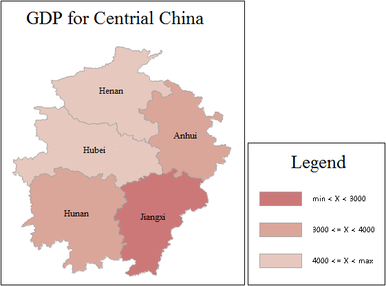

Ranges thematic maps display data of a specific attribute according to ranges
you set. These ranges are shaded with different colors, patterns, line styles,
or symbols. In a range map, the thematic values are divided into several
ranges according to a certain ranging method. A range is assigned to each
feature based on the corresponding thematic value. The same styles, such as
color, fill, and symbol, are applied to features of the same range. A ranges
map must be based on a thematic variable of a numerical type. Ranges maps are
usually used to represent volume or degree characteristics of continuously
distributed phenomena, such as distribution of precipitation and distribution
of soil erosion rate. DEM and GRID layers are also supported.

Click the Range Map button in the Thematic Map tab to generate the default
thematic map. The user can modify the parameter settings on this basis to
create a range map that meets the needs of the drawing. The figure below is a
range map of per capita GDP in all provinces in China in 2000.

  
  
From the figure, we can clearly see the per capita GDP for each province.

You can create ranges maps for a point, line, or region layer. Set a layer as
the current layer before creating a thematic map for it. To do so, you can
select the layer in the Layer Manager. Meanwhile, the map can be edited after
finished. For more information, see [Editing Thematic
Maps](../EditingMap/EditingMap).

### You can create a ranges map through:

[New Ranges Map](RangesMapDefault)

[Modifying Ranges Map](RangesMapGroupDia)

### Related Topics

[Editing Thematic Maps](../EditingMap/EditingMap)
