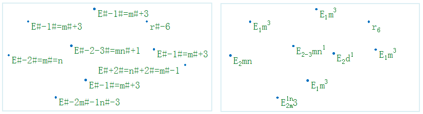
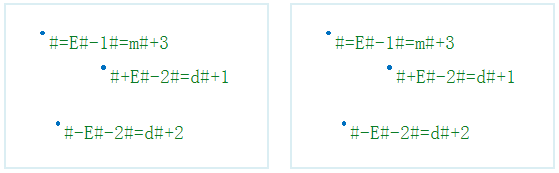
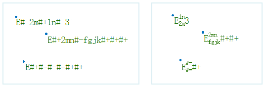
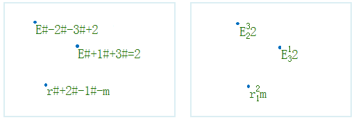

When create the ThemeLabel, you can realize the function for labeling
superscript/subscript through the label expression. If the field of ThemeLabel
is the text, and the superscripts/subscripts need to be displayed in the text,
you can label the superscripts/subscripts by meeting a particular expression
and using the Superscript/Subscript function.

The types that support the Superscript/Subscript function are: Uniform, Ranges
and Label Matrix ThemeLabels.

The Superscript/Subscript function is often used when label the map. For
example, when you label the region unit: km2. In the UDB datasource, the label
expression is Provinces_R.AREA||"km#+2" or Provinces_R.AREA||'km#+2'. In the
Oracle datasource, the label expression is Provinces_R.AREA||'km#+2'. Where
Provinces_R.AREA records the area values of each administrative area, and it
is a double field. While labeling, the numeric field will be converted into
text, and then connect with area unit (km2) for display. Note that the hyphen
in the UDB or Oracle datasource is "||", as shown below:

### Rules of the Label Expression

In order to display the superscripts/subscripts, the label expressions should
be written according to a certain rules:

1. In the text expression containing the superscripts/subscripts, #+ represents the superscript; #- represents the subscript; #= represents that split a string into two superscript and subscript. 

2. Set the text label that supports the label expression. If it starts with #+, #- and #=, it will output the original string. 

3. When it meets the #+ or #-, the string next to it all regarded as the superscripts/subscripts contents. When it meets the #+ or #- third times, it will adopt the new string rules. 

4. In the text expression containing the superscripts/subscripts, the effect of two continuous #+ is the same as a #-, and the effect of two continuous #- is the same as a #+. 

### Note

* The justification of the label with the superscripts/subscripts can only be Top-Left. The justification of the label without the superscripts/subscripts is the same as the justification set in the text style.
* It doesn't support the text label with the angle of rotation, and the rotation angle of the text label isn't 0, the Superscript/Subscript function is invalid.
* When the map has an angle of rotation, the text label with superscripts/subscripts won't rotate with the map rotation.

