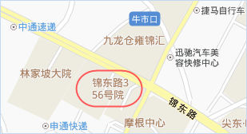
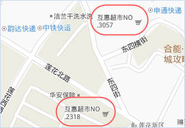
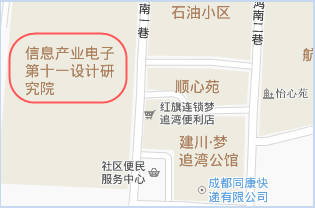
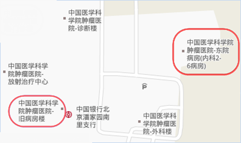
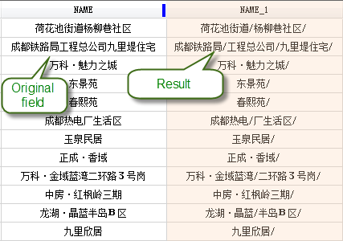
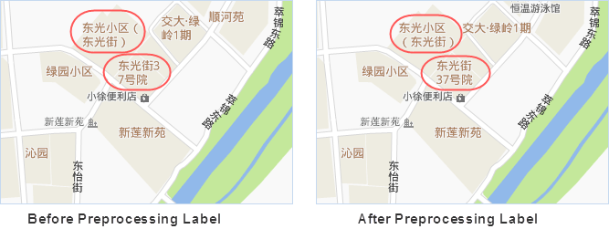

When setting line wrap for the labels in making label thematic map, some label
are displayed unreasonably and unsightly. The Preprocess Label function can
add a separator in the text field based on relevant segmentation principle.
Then use the preprocessed text field to make label thematic map.

There are some principles as follows:

* Maintain and ensure multiline text alignment;
* Two line alignment is preferred;
* Each line contains 4-8 words as much as possible;
* If the last line is left with only one text, the text is referred to be displayed in the previous line;
* Make "(" not shown separately at the end of the last line,")"not displayed separately at the beginning of the next line;
* Complete data, word should be in continuous display, not split into two lines;
* The abbreviation "." follows the abbreviated word.

**The Preprocess Label function can solve the following problems:**

1. Complete data, word is split into multiple lines;

2. A half bracket is at the end of a line or in the beginning of a line.

3. The abbreviation "." doesn't follow the abbreviated word.

4. The text number is very different between lines, or it only lefts a word in the last line;

5. Phrases with numbers and short line are broken down into multiple lines.

### Basic Steps

1. When setting line wrap for the labels in making label thematic map, some label are displayed unreasonably and unsightly. The Preprocess Label function can add a separator in the text field based on relevant segmentation principle. Then use the preprocessed text field to make label thematic map.
2. Click Thematic Mapping>Label>Preprocess Label to open the dialog, set the dataset and field to be processed, then set the following parameters: 
* Save Result: the preprocessed result can be saved in a new field or the original field.
* Label Font: it's recommended to set the same type with the label thematic map. The font will affect the wrap width.
* Split Char: select or input a English char as the split char, that is, insert the specified char in suitable position as the wrap char.
* Max Split Length: set the maximum display length of each line, recommended to be 4-8. The priority of the parameter is after the processing principle. 
3. After the preprocessing function is performed successfully, the field value of the result field will be added the wrap char in the wrap position, as shown in the following figure, on the left is the original field information, and on the right is the result of preprocessing.

4. To make a better display effect, set Expression to the preprossed result field, set the split char in Advanced tab, then the labels will be displayed according to the preprocessed result.

