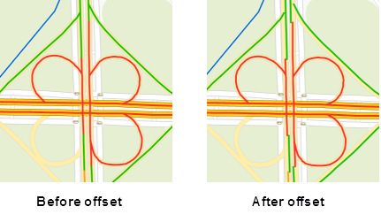

It is used to set the advanced parameters for the current unique value map.
All the settings on the tab will be reflected on the current Unique Value in
real time.

1. Offset Settings: This is used to set the offset of the point, line and region in the Unique Value. 
  * Offset Unit: It is used to set the offset unit. Click the drop down button on the right, and the system provides two units for users to choose: Map distance units and 0.1 mm. 0.1mm represents that the symbol unit is 0.1 mm, and the Map distance units means that the offset stays the same with the of map coordinate system.
  * Offset X: It is used to set False Easting that the label is relative to its expressive object. You can directly input a value to set the offset, and also can choose a value field from this layer. This field can be the offset.
  * Offset Y: It is used to set False Northing that the label is relative to its expressive object. You can directly input a value to set the offset, and also can choose a value field from this layer. This field can be the offset.
2. Traffic Situation: Used to set the road grading and road offset, Applicable to small scale [traffic road map](../../ApplicationTheme/TrafficCondition/AboutTrafficCondition). 
  * Road Grading: Set the road display, the field value is 0 that does not show traffic.
  * Road Offset: Set the road map in the thematic map of the bi-linear offset distance to both sides. If the offset is positive, it indicates that the offset is to the left of the line direction. If the offset is negative, it indicates the right side offset in the direction of the line, in units of 0.1 mm. Through the road on both sides of the offset, making a small scale can also clearly show the bi-linear road traffic.
  
  
### Note

* The shadow of 2D maps can appear by setting offset for thematic layers.     
* Temporarily does not support the 3D point, line, region layer of the thematic map offset settings.

### Related Topics

[Modify the Unique Value Map.](UniqueValuesMapGroupDia)

[The Properties Tab](PropertiesDia)

