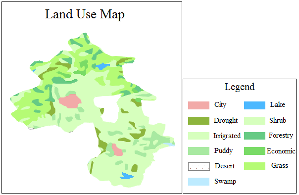

Unique values maps use different colors or symbols to shade or represent
objects with different values for an attribute. You can select an attribute to
create a unique values map, e.g., the soil type attribute. A unique values map
emphasizes on representing quality differences instead of quantity
characteristics of a phenomenon. the DEM and GRID layers are supported.

Click Unique Values Map in the Thematic Mapping tab to generate the system's
default unique values map. The figure below is a unique values map of land
use. Each color represents a land type.

  
 
  
You can create unique values maps for a point, line, or region layer. Set a
layer as the current layer before creating a thematic map for it. To do so,
you can select the layer in the Layer Manager. Meanwhile, the map can be
edited after finished.

In particular, for unique values map of point datasets, if the unique values
style is a symbol, then the symbol size and rotation angle support the
selection of the attribute field, making a custom unique values style setting.
 
For more information, see [Modifying Thematic Maps](../EditingMap/EditingMap).

### You can create a unique values map through:

[New Unique Values Map](UniqueValuesMapDefault)

[Modifying Unique Values Maps](UniqueValuesMapGroupDia)

### Note

You can only create a unique values map for a layer with less than 3000 items of thematic values.

### Related Topics

[Modifying Thematic Maps](../EditingMap/EditingMap)

