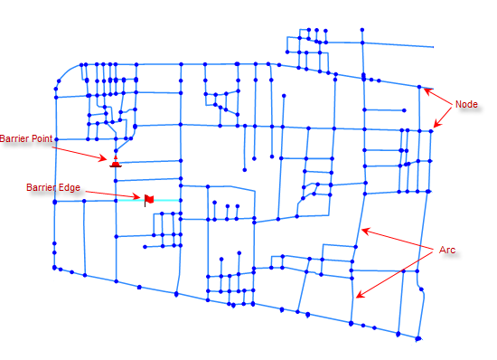
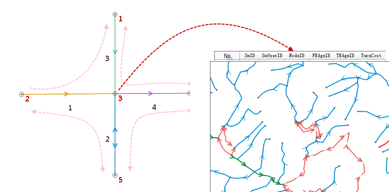

### Overview

Network analysis facilitates the commerce and public services, as well as our
daily life. The analysis results can provide an effective implementation
proposal to help the user to make a more rational decision. Network analysis
can help to solve the following practical problems:

  * What is the shortest route from point A to point B?
  * In the tourist attractions, how to choose a route which can past the most points of the interests at a time?
  * How big is the coverage area of the customers of a newly opened supermarket? And how to determine its purchase volume?
  * How to dispatch the recent fire engines for the rescue in the event of a fire?
  * How can a distributor deliver all his delivery tasks in the shortest time?

In the world of geographic information, public infrastructure (power
facilities, telecommunications and cable TV networks, road transportation,
water network, etc.) are abstracted as **network system** composed by many
interconnected lines. And the network model is the abstraction of the network
system of the real world. Take the urban transportation network for example,
the road and other linear features are abstracted as line segments, which are
also called the network arcs. While the crossroads, the bus stops and the
other point-like features are abstracted as points, in the network which are
also called the network nodes. In the network model, resource information can
transfer from a node to another node along the arc. We can consider the
network is composed of the edges/lines, the intersected points/nodes and the
other elements; it represents a possible path from one location to another
one.

### Basic Concepts

The network is a model which is composed of a group of interrelated arcs,
nodes and their attributes. The network can express the real world's roads,
pipelines, etc.

  
  
As shown in the figure above, the network not only has the abstracted
topological relationship between arcs and nodes, also has geometric location
feature and geographic attribute feature of GIS spatial data (topological
relationship is the cross-correlation between geographic objects in spatial
location, such as the connection relationship of nodes and lines, and lines
and polygons).

The following describes the basic concepts involved in the network model:

  * **Nodes**

Nodes are the places that arcs connects network, as shown above. Nodes can
represent the real road intersections, rivers intersections, etc. The nodes
and arcs respectively correspond to an attribute table, their adjacent
relationships associate by the fields of attribute tables.

  * **Arcs**

The arc segment is an edge in the network connecting with the other arcs by
nodes. The arcs can represent the real-world highways and railways of the
transportation network, the transmission line in the power network, the rivers
of hydrological network, etc. The interconnected relationships between arcs
have topological structure.

  * **Network Resistance**

In our life, from the starting point, after a series of roads and junctions,
we arrive the destination, which is bound to produce a cost measuring by
distance, time and currency. In the network model, the cost of nodes and arcs
is abstracted as the network resistance, and the information is stored in the
attribute fields called the resistance field.

  * **Center Point**

The center points are the discrete devices located at the nodes of the network
and have the capabilities to accept or provide resources. Facilities are the
substances, resources, information, management, cultural environment required
by GIS, etc. For example, the school has educational resources and the
students have to go to school to learn; the retail warehousing point stored
the goods required by the retail outlets, and needs to deliver the goods to
the various outlets. The center point essentially is a node in the network.

  * **Obstacle Edges and Obstacle Points**

The problem of traffic jams in the city can be seen everywhere, which is a
random and dynamic process, and it is no rules to follow. In order to reflect
the real-time situation of transportation network, the traffic-jam arcs need
to have the feature of temporarily inhibiting the passages of vehicles. When
the traffic is back to normal, the attribute of the arc also can be set to
normal in a real time. The concepts of obstacle edges and obstacle points can
solve the above problems very well. The benefit to introduce the concepts of
obstacle edges and obstacle points is that the obstacle settings are
relatively independent, i.e., whether to set the obstacles has nothing to do
with the current network environmental parameters.

  * **Turn Table**

Turning is the process that a arc passes through the middle node to arrive the
adjacent arc. Turning cost is the cost to complete a turning. Turn table saves
the cost of the turning. The turn table must list all the possible turns of
every crossroad, generally including the start arc field (FromEdgeID), the end
arc field (ToEdgeID), the node identification field (NodeID) and the turn cost
field (TurnCost). These fields correlate with the fields in arcs and nodes.
Each record in the table dictates a arc cost passing the road node. Turn cost
is usually directional, the negative cost values of the turning generally
means to prohibit the turning.

For example, for the network analysis of the roads, we often encounter the
crossroads, divergence, etc. The figure on the right is a crossroad diagram,
and the table on the left is a turn table corresponding to the crossroad. In
the turn table, there are the cost records that the vehicles turn at the
crossroads.

  
