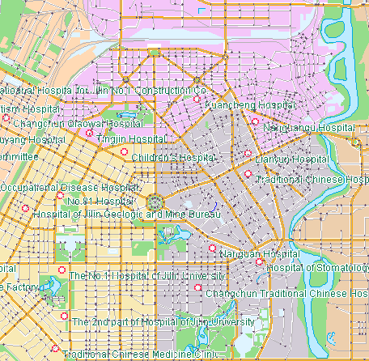

### Overview

Location-Allocation is the perquisite for the success of commercial and non-
commercial organizations. Location-Allocation is to select the optimal
location for one or more service providers in a certain region, so that the
facilities can be one of the most cost-effective ways to provide services and
merchandises. Location-Allocation is more than just how to locate, which also
needs to allocate the demands of the demanding points to the appropriate
facilities service area.

### Application Example

Retailers want to open new chain stores that receive goods from different
manufacturers. A large part of the budget is spent on the transportation of
goods. Hence, if the retailers want to find the location for the new store,
they need to consider the original position of chain stores, in the meanwhile
make sure the lowest transportation costs. For consumers, the chain store must
be built within the maximum distance they are willing to go. Based on the
above factors, the retailers got the locations and the number of the new chain
stores.

### Important Concepts of Location-Allocation

* **Types of Location-Allocation**
  * **Least Center Points Mode** : The analysis results need to distribute the request points as many as possible to the resource-allocation center points within the maximum resistance. This mode has been widely used, e.g., the problem of finding the supermarket location that the retailers want to reduce the chain stores, the problem of determining the route of school buses that needs to make sure the bus stops as few as possible.
  * **Largest Coverage Mode** : Non-Least center points mode, the number of the new locations is decided by the users according to the analysis parameters. Also, the locations need to distribute the resource center points as many as possible to the corresponding resource-allocation center points. This mode is suitable for selecting the locations for fire stations, police stations, hospital, etc.

* **Resource Allocated Center point** : It is the facility point that provides the resource and service and corresponds to the network nodes. Each facility has a maximum resistance value, a center point type, a node ID where the center point in the network, etc. 
  * **Maximum Impedance** : It is used to restrict the cost from the demand point to the center point. If the cost from the demand point to the center point is higher than the maximum impedance, then the demand point is filtered out (i.e. the center cannot be used for the demand points).
  * **Center Point Type** : It includes three types: fixed center point, optional center point and non-center point. Fixed center point is the existing service provider that has been built, such as the existing old chain stores in the application example. Optional center point is the new candidate service provider which needs to be increased, such as the new candidate location of the chain stores in the application example. Non-center points will not be considered in the analysis, in the practical problem it is not allowed to establish the service facility point or the other existed equipment and facility.
  * **Resources Allocation Direction** : Solving the location problem needs to consider the allocated direction of resource center point, including two directions, one is allocating from the center point, the other is not.

For example: A city has 15 hospitals whose distributions are showed in the
figure below. Now you want to select 7 from the 15 hospitals as the city's
centralized hospitals for the physical examination of the college entrance
test. It needs to cover the areas as many as possible to facilitate the
physical examination of the candidates. You will select 7 optimal locations
from the 15 hospitals for the physical examination (as shown in the left
figure, the red symbol represents the 15 hospitals). The hospital of the
physical examination must ensure that it takes the candidates less than 30
minutes to walk or ride. Based on this condition, the Location-allocation
analysis will give the best sites and circle the service range of each
hospital (As shown in the right figure, the points denoted in different colors
represents the 7 optimal locations for the physical examination).

