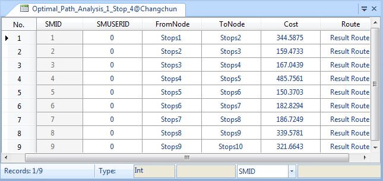
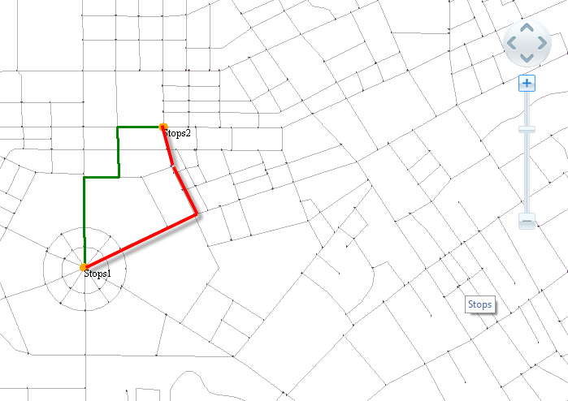

The path analysis is one of the commonly used functions of network analysis.
In the real world, we often need to find the shortest route between two
points, which is important for transportation, fire protection, information
transmission, disaster relief, etc. During the transportation, we need to find
the route of the least transportation cost; during the disaster relief, we
need to find the route of the least time cost.

Actually, the path analysis is used on the specific network to find the
shortest path passing through many routing points, in order to to minimize the
cost and the time required by the trip of a salesman, including the shortest
route analysis and the traveling salesmen analysis.

### Optimal Path Analysis

The optimal path analysis is used to find the path of the least resistance between two points in the network. In case of multiple junctions, the optimal path analysis is performed sequentially. The least resistance has different meanings; such as those based on a single factor like the shortest time, the lowest cost and the best traffic condition, the minimum toll stations, etc. There are also those based on multiple factors like the best traffic condition with the least toll stations.

The shortest route is a special case of the single factor of the optimal path.

### Operating Instructions

1. Before performing the network analysis, you need to set the environment parameters of the network analysis. Click **Traffic Analysis** tab > **Network Analysis** group > **Environment Settings** check box. In the popup window Environment Settings, you can set the parameters of the network analysis, such as the weight value, node/arc ID field, etc. For the introduction of environment settings window please visit [Network Analysis Environment Settings](NetAnalystEnvironmentWIN).
2. Click **Traffic Analysis** > **Network Analysis** > Gallery and select **Optimal Path Analysis** to create an instance of optimal path analysis. For the introduction of instance window, please see [Instance Manger Window](InstanceWIN).
3. To add stations in the current network data layer, iDesktop introduces two ways. One way is to click your mouse on the layer. The other way is to import a point dataset as stations.

Note: iDesktop will analyze the optimal path between all stations added in the Instance Management window in sequence.

  * You can use the way we mentioned above to add barrier points. For the management of the barrier point, please refer to [Barrier Point Manager](BarrierManagement).
  * Click the **Parameter Settings** icon button in the **Instance Management** window to open the **Optimal Path Analysis Settings** window to set related parameters. 
    * **Save Node Info** : Check it to save all passed nodes resulting in a point dataset that will be stored in the same datasource as your network dataset. The point dataset records the ID (NodeID) of each node and the ID (RouteID) of the resulting route that each node locates.
    * **Save Edge Info** : Check it to save all passed edges resulting in a line dataset that will be stored in the same datasource as your network dataset. The line dataset records the ID (EdgeID) of each edge that the resulting route passes.
    * **Stations Statistics** : Check it to save the station statistics resulting in an attribute table dataset. The attribute table records all statistical information of the analysis stops, including each start station (FromNode), each end station (ToNode), each cost (Cost), each route name (Route), etc.

As the following figure shows, the attribute table records the order of
stations that the analysis result passed and required cost. The FromNode and
ToNode fields denote each start station and each end station. The cost field
records the cost of adjacent stations. The Route field records the name of the
generated route.

  

  * **Enable Path Guide**

Check the checkbox to open the Path Guide window which records all resulting
path information. Each record in the window corresponds with a path from a
start station to an end station. For more information, please refer to [Path
Guide](PathGuide).

  * **Least Edges**

Check it to analyze routes with the least number of edges. The number of edges
is least does not mean the sum length of edges is the least. As the following
figure shows, both the two routes are from stop 1 to stop 2. The number of
edges of the red route (4) is less than the number of the edges of the blue
route (8). While after checking the **Least Edges** checkbox, we get the red
route. Therefore, the overall length of the resulting routes may not be the
shortest.

  

* Click **Traffic Analysis** > **Network Analysis** > **Run** button. Or click the Run icon button in the **Instance Management** window to perform the analysis. 

The outputs will be added to the current map automatically when the analysis
finishes. The output window will give a prompt related to the operation as
well.

### Note

  * You can export all stations added in the Instance Management window as a point dataset for further use. For example, you can import it as stations when performing a network analysis next.
  * A station must be within the tolerance range. You can set and modify the node tolerance in the **Environment Settings** window.
  * To modify a station you added, you can click the **Move Station by Mouse** icon button, select the station you want to move, and drag it to your desired position.
  * If you set barrier points in the network analysis layer, iDesktop will display all barrier points in the Instance Management window to manage them. On how to add a barrier point, please visit [Barrier Point Management](BarrierManagement).
  * iDesktop supports managing multiple instances of network analysis at the same time. Click **Traffic Analysis** > **Network Analysis** button Gallery again and select **Optimal Path Analysis** to create a new optimal path analysis. In the **Instance Manager** window, you can switch the network analysis from the drop-down list. If an analysis instance is no longer needed, you can click the **Delete Instance** icon button to delete it. The application will automatically switch to the next analysis instance.
