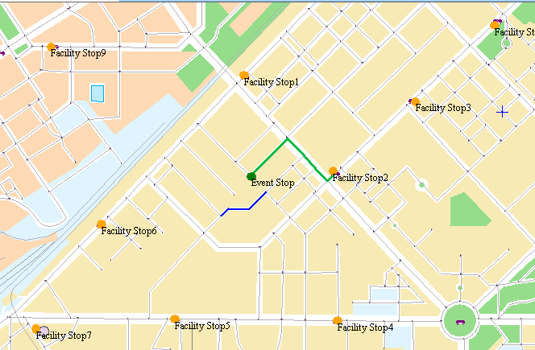

### Overview

**Closest Facility Analysis:** Given a group of event points and facility
points, it will find one or more least-cost facility points for each event
point. And the result shows the optimal path, the cost, and the driving
direction from the event point to the facility point ( or from the facility
point to the event point). In the meanwhile, you can set a query threshold
which is a search scope, once beyond the scope, it will stop to find.

* **Facility Point** : The basic element of the closest facility analysis, such as school, supermarket, gas station, etc.
* **Event Point** : The basic element of the closest facility analysis, which needs the facility point to provide the location of the services.

Closest Facility is often used for unexpected events, such as your car is
short of gasoline, you need to find the nearest gas station; or the sudden
illness which needs to find the nearest emergency center. For example, the
event point is the location of the traffic accident; it needs to find the
nearest hospitals which can be reached within 10 minutes. In this case, the
accident point is an event point; the hospitals around it are the facility
points. Actually, the closest facility is also a path analysis. Therefore you
can also set barrier edges and points, if there are barriers on the driving
route, it will be not be allowed to pass. These cases need to be considered in
the analysis.

### Application Instance

For instance, we know the locations of multiple gas stations and a truck. The
truck is short of gasoline and needs to find a gas station as soon as
possible, which can be reached within 20 minutes. Take finding the closest gas
station as an example, we will explain the procedure of closest facility
analysis in the following:

  1. Set up the basic parameters of network analysis; set the forward/reverse weight field as time field.
  2. Import the gas stations as the facility points.
  3. Import the location of the truck as the event point.
  4. In the **Find Closest Facility Settings** window, set the **Search Direction** as **Event Point-- > Facility**, and set the **Search Radius** as 20 and the **Facilities Number** as 1.
  5. Specify the results dataset, and then perform analysis and check the results.

As shown in the figure below, it is the result of the closest facility
analysis. There are 9 gas stations around the truck, then the final analysis
get the nearest route from the truck to the gas station. Please see the green line in the following figure.

  

### Operating Instructions

1. Open the network dataset to be analyzed.
2. Click **Traffic Analysis** > **Network Analysis** and check the **Environment Settings** checkbox to pop up the **Environment Settings** window. In this window, you can set not only the network analysis parameters (node ID field, for example) but also the analysis result parameters and the tracking analysis parameters (required by the facility network analysis). For specific introduction on environment settings, please refer to [Network Analysis Environment Settings](NetAnalystEnvironmentWIN).
3. Create a new instance for the closest facility query. Click **Traffic Analysis** > **Network Analysis** Gallery > **Find Closest Facility** to pop up the **Instance Management** window. For specific introduction on the Instance Management window, please refer to [Instance Management](InstanceWIN).
4. To add facility points in the current network data layer. iDesktop introduces two ways. One way is to click your mouse on the layer. The other way is to import a point dataset as facility points. For specific operations, please refer to [Add Stations](ImportLocations). 
Once you added a center point in the map window, the added point will be
automatically showed in the **Center** list tree of the **Instance Manager**
window. Right click to end the operation. Note: you need to set an appropriate
tolerance for the node snap. If the position of the mouse clicks beyond the
snap tolerance of the node may lead to the failure of adding a location.

5. The same way can be used to add event points and barrier points in the network layer. For the introduction of the management of the barrier point please visit [Barrier Point Manager](BarrierManagement). 

Note: When the application program is doing the **Find Closest Facility**
analysis, the analysis results are unrelated with the import order of the
facility points. If you need to delete the facility point, you can just select
the node of the **Facility Point** in the list tree, and then select
**Remove** in the right-click menu or click **Delete** in the keyboard.

6. Click **Parameter Settings** button in the **Instance Manager** window of network analysis to pop up the **Find Closest Facility Settings** which is used to set the parameters of the closest facility analysis. 
     * **Find Settings**
       * **Search Direction** : Specify the direction of finding the closest facility from the event point to the facility point or from the facility point to the event point. Different query directions will have distinct influences on the analysis results. For instance, driving from the event point to the facility point needs 15 minutes, but it takes 20 minutes in the opposite direction. 
       * **Search Radius:** The biggest search radius. Search the nearest facility point considering the event point as center and the input radius as search scope. Once the facility point meets the search condition, or beyond the search radius, the query will stop. The unit of the radius is consistent with the unit of the weight field in the network analysis environment. If you want to find the entire network, you need to set the value into 0.
       * **Facilities Number** : Find the number of the closest facility points from the event point. For instance, in the disaster accident, we need to send the injured people to one or more closest hospitals for emergency treatment.
    * **Result Settings**
      * **Save Node Information** : Select to determine whether to store all the nodes information from the event points to the facility points (or from the facility points to the event points) in the analysis results. If you select the check box, then you can save the node information as point dataset and name it. And the dataset will be saved in the data source of the network dataset. In which, the field NodelD denotes the nodes' ID of the facility points in the analysis results, and the field RouteID denotes the ID of the route lines which are from the event points to the facility points in the analysis results.
      * **Save Edge Information** : Select to determine whether to store all the edges information from the event points to the facility points (or from the facility points to the event points) in the analysis results. If you select the check box, then you can save the edge information as line dataset and name it. And the dataset will be saved in the data source of the network dataset. In which, the field EdgeID denotes the ID of the route lines which are from the event points to the facility points in the analysis results.
      * **Open the Path Guide** : Path guide records the path information in the results of network analysis. A path guide object contains a path line from the start to the end. Check "Set Path Guide" to output the analysis results in the Path Guide window. For more information, see [Path Guide](PathGuide).
    * **Enable Turn Table**: The check box can be select to determine whether to enable the turn table or not. For the introduction of the turn table please visit [Turn Table](TurnTable). 
7. After finishing the parameter settings, Click **Execute** button in the **Network Analysis** group of the **Analysis** tab or click the **Execute** button in the **Instance Manager** window. The analysis results will be immediately displayed in the map window, which can be saved as dataset for the future use in the other places.

### Note

  * The information of the event points and facility points can be exported as point dataset for the future similar analysis.
  * The facility points and event points can be put in the nodes and edges of the network or within the vicinity of the node tolerance.
  * If setting the barrier points in the network analysis layer, then the information of the barrier points will be displayed in the **Network Analysis Manager** window in which you can manage them. For how to add a barrier point please visit [Barrier Point Manager](BarrierManagement).
  * By the influence of the search radius, the number of the facility points which have been found is not always equal to (may be less than) the number of the facility points that you want to find.
