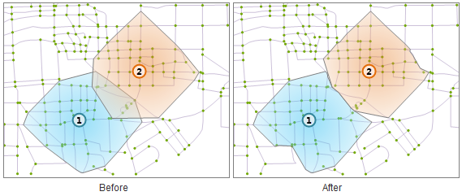
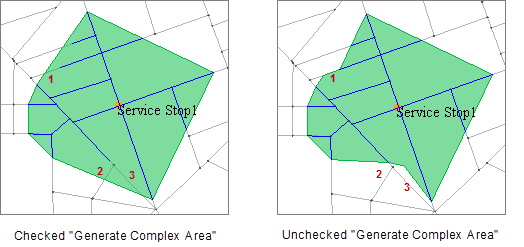

### Overview

The service area analysis is to conditionally find the scope of the service
area that the specified service stations can provide.

Firstly, you need to understand two basic concepts:

  * **Service Stops** : The center point of the service, providing the location of the service, such as a supermarket, post office, community hospital, etc.
  * **Service Area** : The area that within a certain impedance taking specified point as the center and containing all the accessible edges. Simply, it refers to the area that is served by a location according to some certain conditions to provide a particular service, e.g., the governed area of a community police station according to the administrative divisions.

In the network analysis, the network nodes with resources are abstracted as
service stops, the maximum distance of the service stops is abstracted as
service radius. In the analysis results you can get the service network and
service area (polygon). Service Area Analysis can be understood as not to
consider the supply and demand of the resource center, but only the resource
allocation which only considers the edge resistance between the provider and
the demander. The analysis is generally used to evaluate and analyze the
service scopes of the public facilities, such as post office, hospital,
supermarket, etc., so as to provide the references for selecting the optimal
locations of the public facilities.

### Service Area Analysis Parameters

When performing service area analysis, you need to set the process way of the overlapped service area and the analysis directions.

* **Analyze from center point** : Set up the analysis direction of the service area. It indicates the relation mode between the service center and the demand station whether to start the analysis from the service station or not. Analyzing from a service station is that a service center provides the services to a demand stations; whereas analyzing from a demand station is that a demand station initiatively gets services from the service center. For example, a milk station delivers milk to various settlements. To perform the service area analysis on this milk station for getting the service range must choose the mode of analyzing from the center point. Another example, to perform the service area analysis on a school must choose the mode of analyzing from the demand stations, because student going to school is an initiative behavior.
* **Service Stop Mutex** : When a service area overlaps other areas, you must determine whether the overlapped service area needs to treat with the mutual exclusion. According to the distance between the center points, the application judges whether the service areas are overlapped. If the adjacent service areas are overlapped in the analysis results, it will do the exclusive process. As shown in the figures, you can see the difference before and after the processing clearly.
  

* **Generate Complex Area** : Generate more detailed result. If you do not check it, the results are some simple regions generated according to nodes with some route lines as following 1, 2, 3. Otherwise, the program will generate regions in strict accordance with routes.
  
