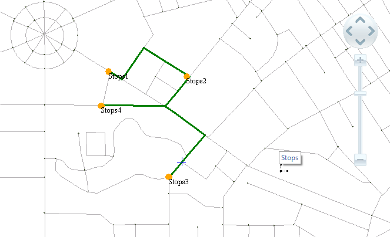
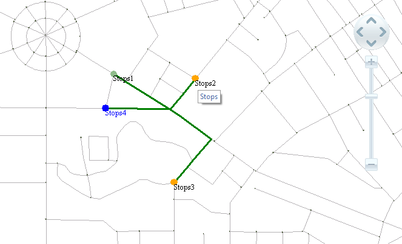

### Overview

The path analysis is one of the common functions of network analysis. In the
real world we often need to find the shortest route between two points.
Solving the problem has a great significance on transportation, fire
protection, information transmission, disaster relief, etc. During the
transportation, we need to find the path of the least transportation cost;
during the disaster relief, we need to find the path of the least time cost.

### Traveling Salesman Problem Analysis

Traveling salesman problem (TSP) analysis is unordered path analysis. The TSP
analysis can decide the order to visit the nodes, and its target is to get the
minimum (or close to the minimum) sum of the travel-route impedances. The
difference between TSP analysis and the optimal path analysis is the method to
visit all the network nodes. The former can decide the visiting order of the
nodes, but the latter must visit the nodes according to the specified order.

For the results of optimal path analysis and TSP analysis with same stations
please see the following figures.

 
  
The TSP analysis of SuperMap GIS must specify the origin node, and the default
origin node is the first node. If you specified the destination node, then the
destination node can be visited at last. If the origin node and the
destination node is the same point, then the TSP analysis will return to the
origin node at last, so you need to specify the node as the origin-destination
(OD) point.

There are four types of nodes in the TSP analysis: origin point, destination
point, midpoint, origin-destination (OD) point. According to the different
settings of the nodes, the results can be divided into the following
situations:

  * **Specifying the origin point** : The application program begins to analyze at the origin point and iterates according to the principle of least cost to get the optimal traveling path. As shown in Figure 2, specifying stop 1 as the origin point. The analysis will begin at stop 1 and visit the other midpoints according to the principle of the least path cost.
  * **Specifying the origin point and the destination point** : The application program begins to analyze at the origin point and stops at the destination point. The analysis gets the optimal traveling path according to the iterative principle of least cost. As shown in figure 3, the stop 1 (Chaoyang Park) is specified as the origin point, and the stop 5 (Nanhu Park) is specified as the destination point. It begins to analyze at stop 1 and returns at stop 5 at last.
  * **Specifying the OD point** : The OD point means the origin point and the destination point is the same point. The analysis of specifying the OD point is that the system begins at the origin point and finishes at the destination point; the middle analysis gets the optimal traveling path according to the iterative principle of least cost. As shown in figure 4, the stop 1 (Chaoyang Park) is specified as the origin point. The analysis result sets out at stop 1 and returns at stop 1 at last.
