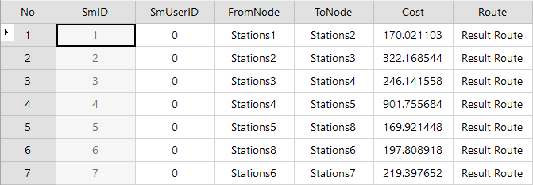

### Introduction

TSP is an undirected path analysis. TSP can determine the visiting order of
the nodes so that the total impedance of the tour route is (or at least close
to) minimum. For the introduction of TSP please visit [TSP
Overview](8-1TSP).

### Basic Steps

1. Open the network dataset of network analysis.
2. Before performing the network analysis, you need to set the environment parameters of the network analysis. In the **Network Analysis** group on the **Traffic Analysis** tab, check the **Environment Settings** check box, then the **Environment Settings** window pops up, in which you can set the parameters of the network analysis, such as the weight value, node/arc ID field, etc. For the introduction of environment settings window please visit [Network Analysis Environment Settings](NetAnalystEnvironmentWIN).
3. In the **Network Analysis** group on the **Traffic Analysis** tab, click the drop-down button of the Gallery, and then select **FindTSPPath** to create an instance of TSP analysis. For the introduction of instance window please visit [Instance Manager Window](InstanceWIN).
4. Click the mouse to select the locations of the stations you want to add in the current network data layer. There are two ways to add stations: One is to add a station by clicking the **Mouse Adding** in the **Instance Manager** window, the other is to import the point dataset as the stations. For specific operations, please refer to [Add Stations](ImportLocations). <br\>Note: In the **Network Analysis Manager** window, you can set the types of the stations. Select a stop in the Stops tree list, in the right-click menu you can set the stop as the start point, the end point, the middle point or the origin-destination (OD) point. The start point is the origin point of the TSP analysis. The end point is the destination point of the TSP analysis, which is ultimately analyzed. The OD point denotes the point is the start point as well as the end point, i.e. the route of TSP analysis starts or ends at the same point. The default is that the first station is the start point and the other point is the middle point.
5. The same way to add can be used to set barrier points in TSP analysis. For the introduction of the management of the barrier point please see [Barrier Point Manager](BarrierManagement).
6. Click **Parameter Settings** button in the **Instance Manager** window of the network analysis to pop up the **Find TSP Path Settings** dialog box which is used to set the analysis parameters. 
    * **Saving Node Information**: Select to determine whether all the nodes information passed by the analysis results are saved. If you select the check box, then you can store the node information as the point dataset, and name it. And the dataset will be stored in the data source of the network dataset. The node information records the node's ID number (NodeID) and the result routing ID number (RouteID).
    * **Saving Edge Information**: Select to determine whether all the edges information passed by the analysis results are saved. If you select the check box, then you can save the edge information as line dataset, and name it. The dataset will be saved in the data source of the network dataset. The edge information record the edge's ID number (EdgeID) that passes the result routing.
    * **Stop Statistics Information**: Determine whether to save the statistics information of the stops. If you check it, the application will save it as attribute table dataset and name it. The dataset will record the statistics information on the analysis stops, including the start stops, the end stops, the cost, etc.  As shown in the following figure, there is an attribute table of stop statistics. The table records the order of analysis results that pass through every stop and the cost. The **FromNode** and **ToNode** fields denote the start stop and the end stop. The cost field denotes the cost between adjacent sites. The Route field denotes the name generated by the analysis.    
    * **Open the Path Guide**: path guide records the path information in the results of network analysis. A path guide object contains a path line from the start to the end. Check "Set Path Guide" to output the analysis results in the Path Guide window. For more information, see [Path Guide](PathGuide).
7. Click the **Execute** button in the **Network Analysis** group on the **Traffic Analysiss** tab or click in the **Instance Manager** window, perform the TSP analysis according to the setting parameters. 

The analysis results will be automatically added to the current map after executing the command, while the output window will prompt that "the TSP analysis is successful".

### Note

  * You can export the stop information in the stop list tree as point dataset to facilitate the similar network analysis in the future, which you can use it by direct import .
  * The stops must be located at the nodes or the edges of the network, or at the area of the setting tolerance. You can set and modify the node tolerance in the **Environment Settings** window.
  * To modify the stop location, you can click the **Mouse Moving** button, and then select the stop you want to move, drag it to the appropriate location.
  * If you set the barrier points in the network analysis layer, then the information of the barrier points would be displayed in the Network Analysis Manager window in which you could manage them. For how to add a barrier point please visit [Barrier Point Manager](BarrierManagement).
  * The application program supports to manage many instances of network analysis simultaneously. Click **Network Analysis** button again, and then select the **FindTSPPath** , you can create a new TSP analysis. In the **Instance Manager** window, you can switch the different types of network analysis in the drop-down list. If you no longer need some analysis instance, then click **Delete the instance** button to delete the current instance, the application will automatically switch into the next analysis instance for displaying.

### Related Topics

[TSP Analysis Overview](8-1TSP)
