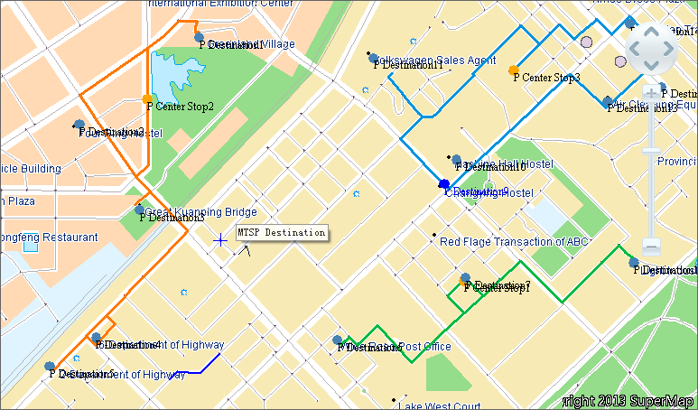

### Overview

Multiple traveling salesman problem (MTSP) is a generalization of the well-
known traveling salesman problem (TSP), where more than one salesman is
allowed to be used in the solution. MTSP is to find the shortest delivery
route from M points of origins to N points of destinations (M and N are
integers greater than 0). The MTSP of SuperMap Desktop .NET is used for
finding the least-cost delivery order and route.

The application offers two delivery options: **Least Total Cost and Overall
Average Cost**. The default option is **Overall Average Cost** , which
controls every single cost of the origins to make the cost for every origin
tend to be equal, but the total cost may not be minimum. If you select **Least
Total Cost** , some points of origins may be provided much more cost than the
others, but the total cost is minimum.

### Application Instance

There are 3 large wholesale markets (origins) that provide vegetables and
fruits for 13 community markets (destinations) every day. Every origin has a
truck, and it must distribute the goods to its destinations according to the
optimal order and ensure that the total cost is minimum. Each destination can
only have one truck to distribute the goods, and the truck must return to its
origin at last. The MTSP of SuperMap Desktop .NET can help solve the problem.

The results of MTSP will show the optimal delivery route in the map window and
generate an attribute table that records the node and cost information of each
delivery arc. As shown in the figure below, the red icons denote the origins,
the brown icons denote the destinations, and the routes of different colors
denote different delivery routes.

  
